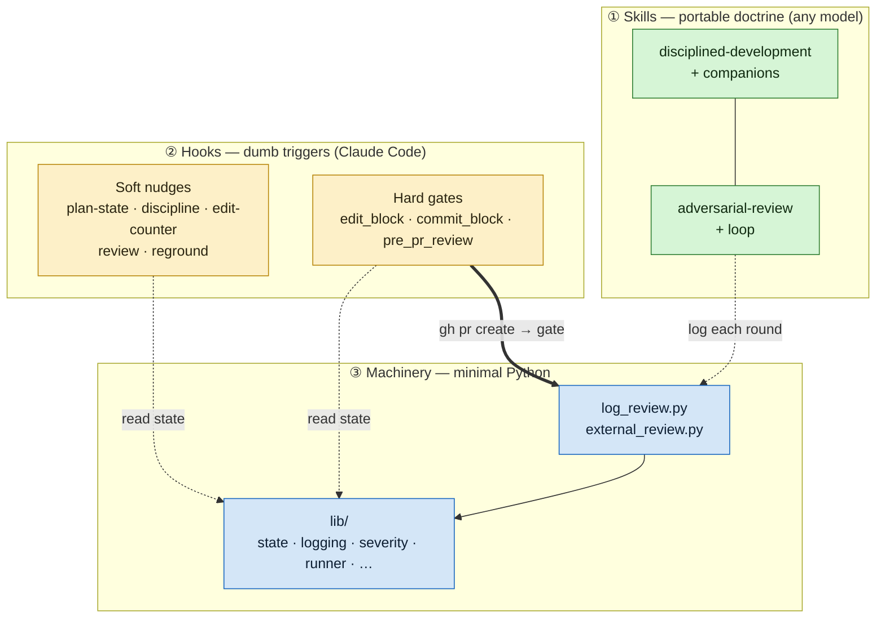
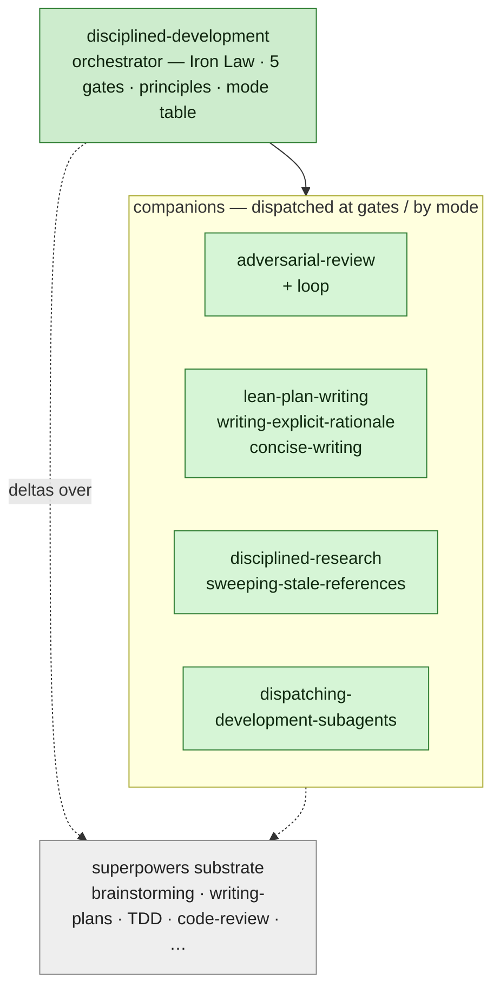
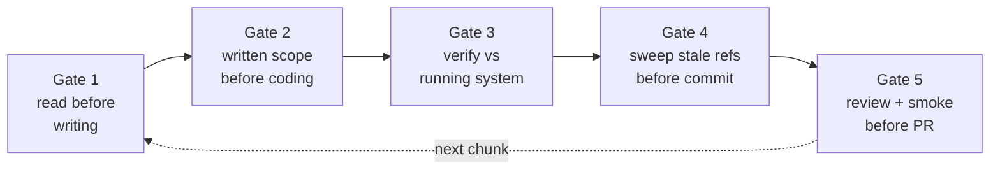
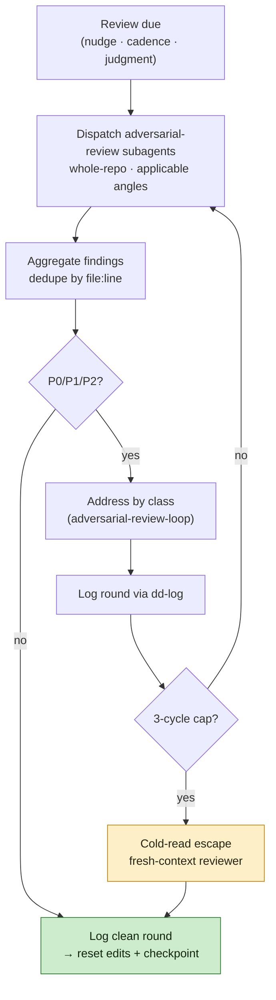
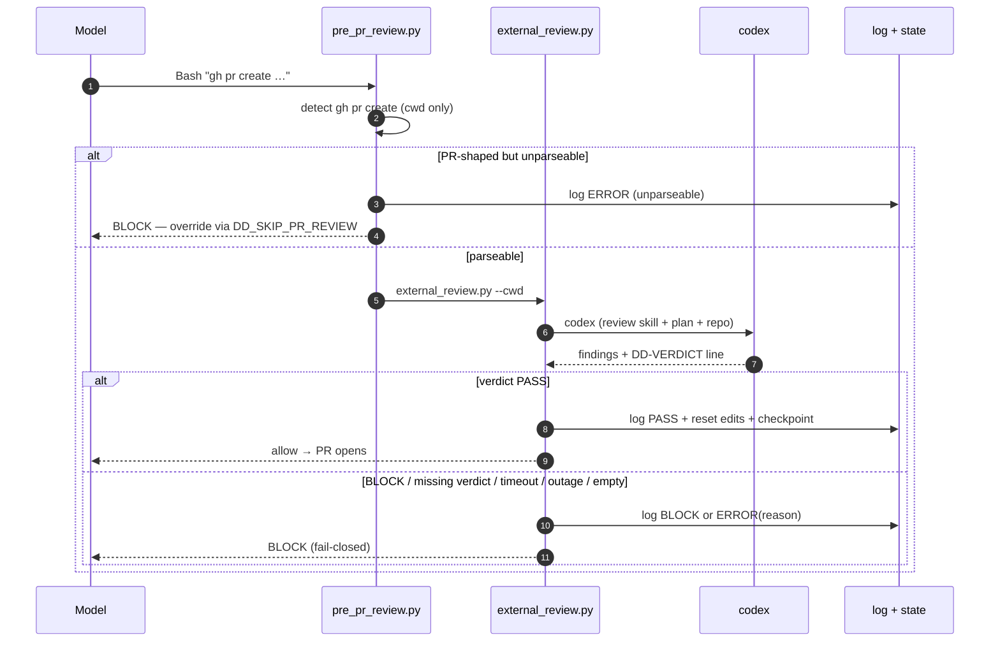
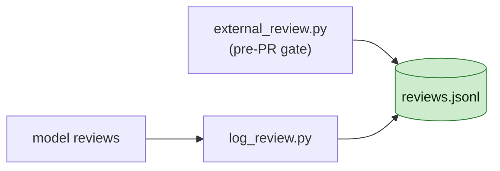

# Architecture

How `disciplined-development-skills` fits together, top to bottom. This is a
**map**: enough framing to see what's here and how it works. For the rules
themselves, read the skill bodies; for low-level behavior, read the code. Every
section points to its source of truth.

## The problem, and the answer

Written records govern how a project works, but momentum erodes them — over a
long, semi-autonomous run an agent stops re-reading, starts trusting memory,
skips the test, and claims done without verifying. The answer here: **the file
wins.** Discipline is written as portable doctrine and surfaced at concrete
boundaries by dumb triggers. The model does the work; the framework keeps it
honest.

Two parts, deliberately split:

- **Skills** — model-facing doctrine, harness-agnostic. The actual content.
- **Hooks** — Claude Code-specific triggers that mark a moment (a tool call, a
  commit, a PR open, a session start); they never decide *what* to say. A small
  **machinery** layer (two tools + `lib/`) is the only Python the hooks need.

## At a glance: three layers

The portable layer never calls the machinery directly except through one
optional, gracefully-degrading instruction (log a review round when the project
provides a command). The hooks read per-branch state to decide whether to nudge
or block; the two tools are the only **writers** of that state and the review log.

## The skill layer

Nine skills: one **orchestrator** and eight **companions** it dispatches, all
sitting on the [`superpowers`](https://claude.com/plugins/superpowers) substrate
as deltas over its base skills.

| Role | Skills | Owns |
|---|---|---|
| Orchestrator | `disciplined-development` | the Iron Law, 5 gates, principles, mode table |
| Review | `adversarial-review`, `adversarial-review-loop` | reviewer posture + angle catalog; the review→fix→re-review loop |
| Authoring discipline | `lean-plan-writing`, `writing-explicit-rationale`, `concise-writing` | plan density; rationale-on-page; prose tightening |
| Grounding | `disciplined-research`, `sweeping-stale-references` | claims in current source; reconcile every stale reference |
| Dispatch | `dispatching-development-subagents` | subagent scope contract + verify-every-commit |

Each skill's `SKILL.md` under [`skills/`](skills/) is the source of truth for its
rules — this table is the map, not the content.

## Orchestration — how a session is governed

`disciplined-development` is the engine. Its **Iron Law** — *no progress past a
gate without the artifact it requires* — fires five fail-closed gates across a
unit of work:

The gates are action-forcing boundaries; behind them sit eight standing
**principles** they enforce:

| # | Principle |
|---|---|
| 1 | Write it down, don't remember it |
| 2 | Re-read, don't recall |
| 3 | Obey what's written; surface what isn't |
| 4 | Carry discipline into subagent dispatches |
| 5 | Test-first for behavior changes |
| 6 | Verify load-bearing claims vs reality |
| 7 | Keep it simple |
| 8 | Review periodically |

A **mode-emphasis table** then routes which companions activate per mode —
brainstorming, plan writing, implementation (sequential / parallel), debugging,
code review (giving / receiving), doc editing. Each gate names a REQUIRED
sub-skill; the mode table names the methodology skill. The full gate text,
principle bodies, the gate↔principle mapping, and the routing table are in
[`disciplined-development/SKILL.md`](skills/disciplined-development/SKILL.md).

## Sub-flows — skills in composition

The gates and modes compose into a few recurring flows. Each names the skills it
leans on; the skills carry the detail.

- **Plan / design** — [`superpowers:brainstorming`](https://claude.com/plugins/superpowers)
  settles scope, then `superpowers:writing-plans` +
  [`lean-plan-writing`](skills/lean-plan-writing/SKILL.md) turn it into a plan
  whose prose is the contract; a written diff is signed off on the document
  (Gate 2).
- **Implement** — re-read sources (Gate 1) → test-first
  (`superpowers:test-driven-development`) → verify against the running system
  (Gate 3) → sweep stale references (Gate 4) → review (Gate 5). Delegated work
  goes through
  [`dispatching-development-subagents`](skills/dispatching-development-subagents/SKILL.md):
  scope contract out, every returned commit diffed back.
- **Edit docs / specs** — [`concise-writing`](skills/concise-writing/SKILL.md) +
  [`writing-explicit-rationale`](skills/writing-explicit-rationale/SKILL.md),
  with a [`sweeping-stale-references`](skills/sweeping-stale-references/SKILL.md)
  pass when a load-bearing fact moves.
- **Review** — the deep dive below.

## The review model

One review mode: **deep, whole-repo, plan-anchored.** No light or diff-scoped
tier; the model selects *which* angles to apply per
[`adversarial-review`](skills/adversarial-review/SKILL.md)'s "When to apply," but
always reviews the whole repository against the active plan. Reviews happen in
two places — a model-driven loop, and the pre-PR gate.

### Model-driven review loop

A clean round (zero P0/P1/P2) logs a `PASS` row and resets both cadence counters;
a blocking round logs `BLOCK` and changes no state. The iteration cap and
cold-read escape are owned by
[`adversarial-review-loop`](skills/adversarial-review-loop/SKILL.md).

### Pre-PR gate (deterministic, fail-closed)

The gate reads codex's **declared** `DD-VERDICT: PASS|BLOCK` (the last non-blank
line), never a severity count. Any failure to produce a clean verdict —
missing/unparseable verdict, codex missing, timeout, empty output — blocks; the
human overrides with `DD_SKIP_PR_REVIEW`.

## Hooks & machinery

The hooks are dumb triggers — eight event hooks, three of them hard blocks (the
edit ceiling, the commit ceiling, the pre-PR gate); the rest are advisory nudges.
A hook fires a fixed message at a boundary and nothing more. Two per-branch state
files — `edits.count` and `review.checkpoint` — drive the cadence; the edit- and
commit-cadence state machines are diagrammed in
[`hooks/README.md` § State model](skills/disciplined-development/hooks/README.md#state-model).

Two tools do the writing — `log_review.py` (records a round; resets cadence on a
clean pass) and `external_review.py` (the codex gate) — on top of `lib/` (state,
logging, severity-parsing, subprocess). The hook table, observability, and
extension rules are in
[`hooks/README.md`](skills/disciplined-development/hooks/README.md); config keys
in
[`hooks/dd-config.md`](skills/disciplined-development/hooks/dd-config.md).

### Logging

Every attempt — model-driven or gate; clean, blocked, or failed — appends one row
to `reviews.jsonl` through a single writer (`logging_setup.append_review`).
Durable (never aged out), append-only, sparse by source; the field groups are in
[`hooks/README.md` § Observability](skills/disciplined-development/hooks/README.md#observability).

## Where to look

- **Install / recover / wire:** [`README.md`](README.md)
- **Doctrine (the rules):** each `skills/<name>/SKILL.md`
- **Hook behavior, state model, observability:** [`hooks/README.md`](skills/disciplined-development/hooks/README.md)
- **Config schema + env vars:** [`hooks/dd-config.md`](skills/disciplined-development/hooks/dd-config.md)
- **Upgrading a deployment:** [`MIGRATIONS.md`](MIGRATIONS.md)
