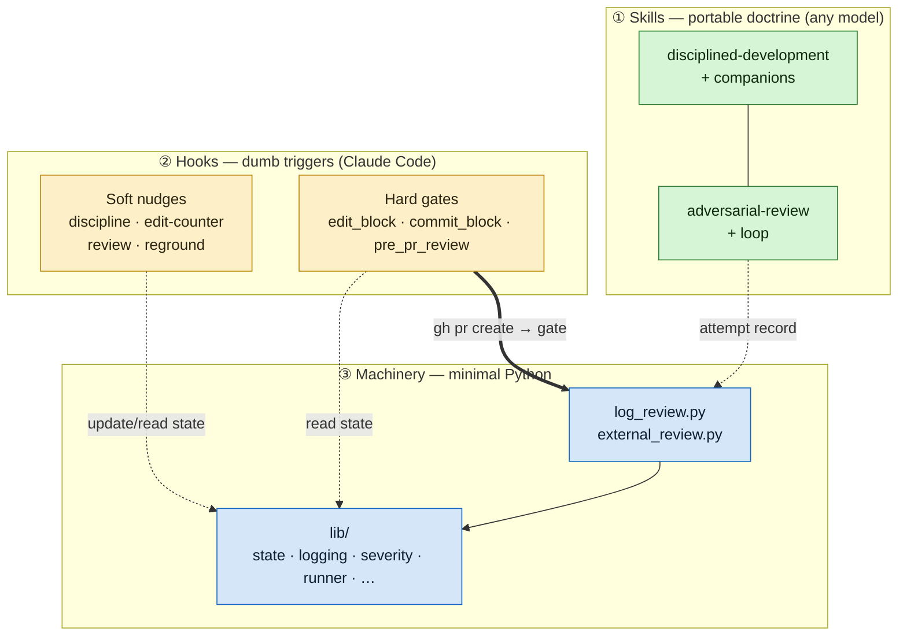
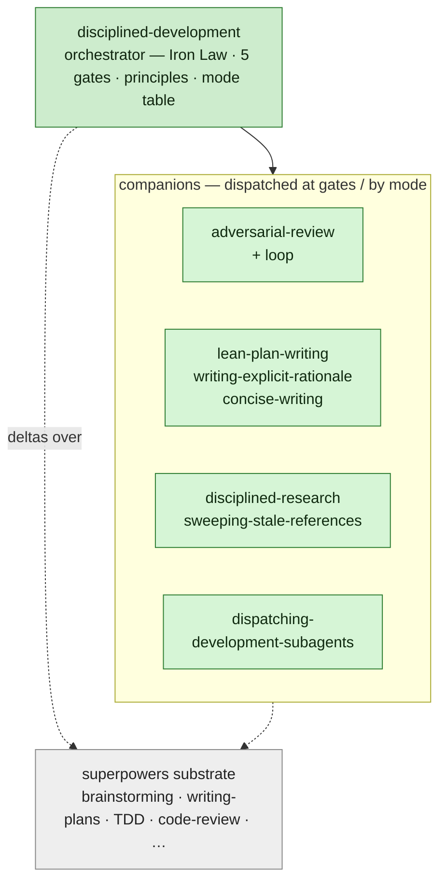
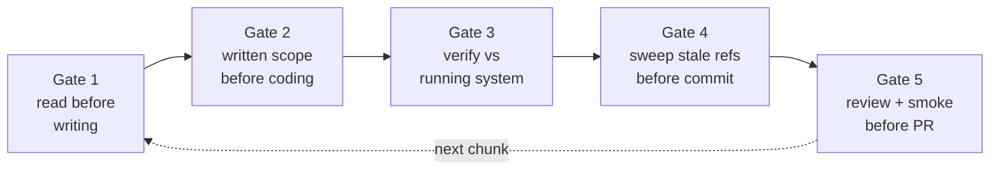
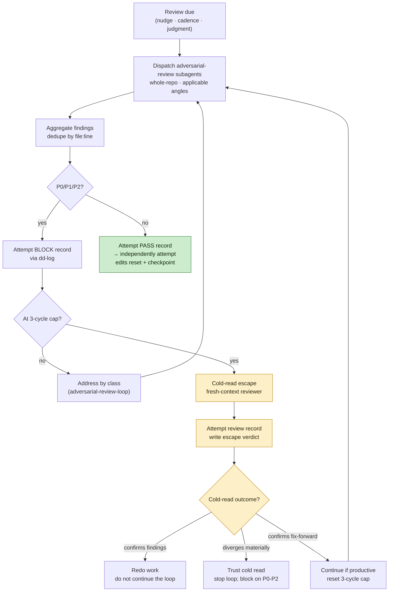
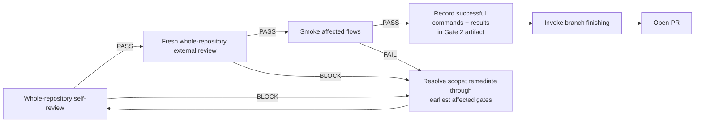
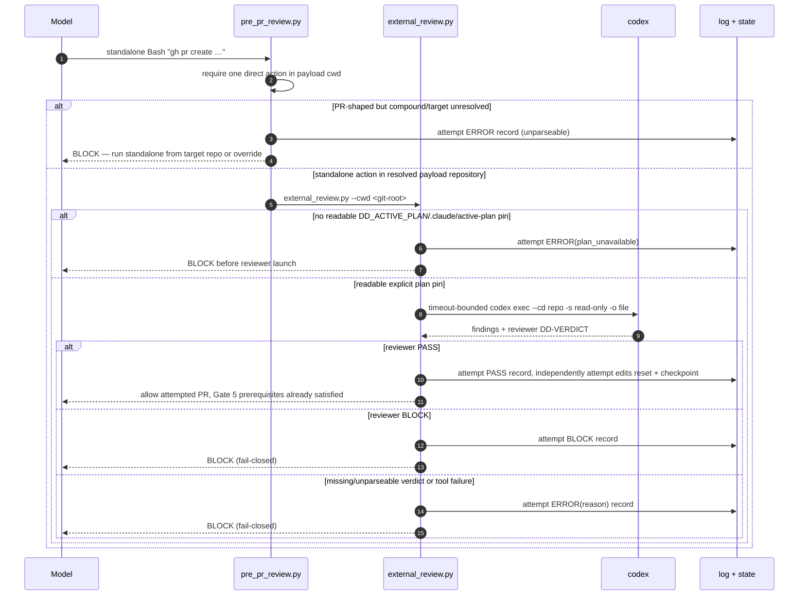
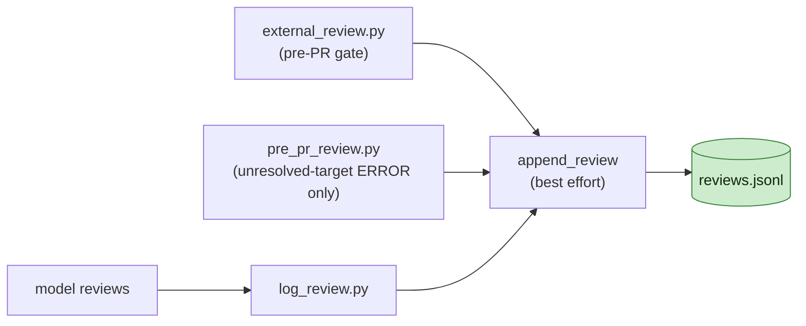

# Architecture

How `disciplined-development-skills` fits together, top to bottom. This is a
**map**: enough framing to see what's here and how it works. For the rules
themselves, read the skill bodies; for low-level behavior, read the code. Every
section points to its source of truth.

## The problem, and the answer

Written records govern how a project works, but momentum erodes them — over a
long, semi-autonomous run an agent stops re-reading, starts trusting memory,
skips the test, and claims done without verifying. The answer here: **the file
wins.** Discipline is written as portable doctrine and surfaced at concrete
boundaries by dumb triggers. The model does the work; the framework keeps it
honest.

Two parts, deliberately split:

- **Skills** — model-facing doctrine, harness-agnostic. The actual guidance is
  Markdown; `adversarial-review` also bundles a deterministic output renderer.
- **Hooks** — Claude Code-specific triggers that mark a moment (a tool call, a
  commit, a PR open, a session start); they never decide *what* to say. A small
  **machinery** layer (two tools + `lib/`) is the only Python the hooks need.

## At a glance: three layers

```mermaid
flowchart TB
    subgraph L1["① Skills — portable doctrine (any model)"]
        direction LR
        DD["disciplined-development<br/>+ companions"]
        AR["adversarial-review<br/>+ loop"]
        DD --- AR
    end
    subgraph L2["② Hooks — dumb triggers (Claude Code)"]
        direction LR
        SOFT["Soft nudges<br/>discipline · edit-counter<br/>review · reground"]
        HARD["Hard gates<br/>edit_block · commit_block · pre_pr_review"]
    end
    subgraph L3["③ Machinery — minimal Python"]
        direction LR
        TOOLS["log_review.py<br/>external_review.py"]
        LIB["lib/<br/>state · logging · severity · runner · …"]
        TOOLS --> LIB
    end
    HARD ==>|"gh pr create → gate"| TOOLS
    AR -.->|"attempt record"| TOOLS
    SOFT -.->|"update/read state"| LIB
    HARD -.->|"read state"| LIB
    classDef s fill:#d6f5d6,stroke:#2e7d32,color:#102a10;
    classDef h fill:#fdf0c8,stroke:#b8860b,color:#2a2410;
    classDef m fill:#d4e6f7,stroke:#1565c0,color:#0e1f33;
    class DD,AR s
    class SOFT,HARD h
    class TOOLS,LIB m
```

The portable layer does not depend on the machinery layer. A skill may invoke
its own bundled support script, while review logging remains one optional,
gracefully-degrading instruction when the project provides a command. Cadence
hooks update counters and read
per-branch state to decide whether to nudge or block. Three production callers
attempt review-log writes through `logging_setup.append_review`: the two review
tools, plus the pre-PR wrapper's unresolved-command ERROR path. Only a review
tool can reset cadence, on an explicit PASS supplied by its orchestrator or
external reviewer.

## The skill layer

Nine skills: one **orchestrator** and eight **companions** it dispatches, all
sitting on the [`superpowers`](https://claude.com/plugins/superpowers) substrate
as deltas over its base skills.

```mermaid
flowchart TB
    DD["disciplined-development<br/>orchestrator — Iron Law · 5 gates · principles · mode table"]
    subgraph COMP["companions — dispatched at gates / by mode"]
        direction LR
        REV["adversarial-review<br/>+ loop"]
        AUTH["lean-plan-writing<br/>writing-explicit-rationale<br/>concise-writing"]
        GR["disciplined-research<br/>sweeping-stale-references"]
        DSP["dispatching-<br/>development-subagents"]
    end
    SP["superpowers substrate<br/>brainstorming · writing-plans · TDD · code-review · …"]
    DD --> COMP
    DD -.->|"deltas over"| SP
    COMP -.-> SP
    classDef o fill:#cdeccd,stroke:#2e7d32,color:#10250f;
    classDef c fill:#d6f5d6,stroke:#2e7d32,color:#102a10;
    classDef sp fill:#eeeeee,stroke:#888888,color:#222222;
    class DD o
    class REV,AUTH,GR,DSP c
    class SP sp
```

| Role | Skills | Owns |
|---|---|---|
| Orchestrator | `disciplined-development` | the Iron Law, 5 gates, principles, mode table |
| Review | `adversarial-review`, `adversarial-review-loop` | reviewer posture + angle catalog; the review→fix→re-review loop |
| Authoring discipline | `lean-plan-writing`, `writing-explicit-rationale`, `concise-writing` | plan density; rationale-on-page; prose tightening |
| Grounding | `disciplined-research`, `sweeping-stale-references` | claims in current source; reconcile every stale reference |
| Dispatch | `dispatching-development-subagents` | subagent scope contract + verify-every-commit |

Each skill's `SKILL.md` under [`skills/`](skills/) is the source of truth for its
rules — this table is the map, not the content.

## Orchestration — how a session is governed

`disciplined-development` is the engine. Its **Iron Law** — *no progress past a
gate without the artifact it requires* — fires five fail-closed gates across a
unit of work:

```mermaid
flowchart LR
    G1["Gate 1<br/>read before<br/>writing"] --> G2["Gate 2<br/>written scope<br/>before coding"] --> G3["Gate 3<br/>verify vs<br/>running system"] --> G4["Gate 4<br/>sweep stale refs<br/>before commit"] --> G5["Gate 5<br/>review + smoke<br/>before PR"]
    G5 -.->|"next chunk"| G1
```

The gates are action-forcing boundaries; behind them sit eight standing
**principles** they enforce:

| # | Principle |
|---|---|
| 1 | Write it down, don't remember it |
| 2 | Re-read, don't recall |
| 3 | Obey what's written; surface what isn't |
| 4 | Carry discipline into subagent dispatches |
| 5 | Test-first for behavior changes |
| 6 | Ground every factual claim and disclose its support |
| 7 | Keep it simple |
| 8 | Review periodically |

A **mode-emphasis table** then routes which companions activate per mode —
brainstorming, plan writing, implementation (sequential / parallel), debugging,
code review (giving / receiving), doc editing. Required sub-skills are marked
explicitly in the active gates and principles; the mode table names methodology
skills. The full gate text, principle bodies, the gate↔principle mapping, and the
routing table are in
[`disciplined-development/SKILL.md`](skills/disciplined-development/SKILL.md).

## Sub-flows — skills in composition

The gates and modes compose into a few recurring flows. Each names the skills it
leans on; the skills carry the detail.

- **Plan / design** — [`superpowers:brainstorming`](https://claude.com/plugins/superpowers)
  settles scope, then `superpowers:writing-plans` +
  [`lean-plan-writing`](skills/lean-plan-writing/SKILL.md) turn it into a plan
  whose prose is the contract; a written diff is signed off on the document
  (Gate 2).
- **Implement** — re-read sources (Gate 1) → test-first
  (`superpowers:test-driven-development`) → inspect the returned candidate and
  dispose of unauthorized work → verify the conforming candidate against the
  running system (Gate 3) → sweep stale references and prepare the coherent green
  commit (Gate 4) → review (Gate 5). Delegated work
  goes through
  [`dispatching-development-subagents`](skills/dispatching-development-subagents/SKILL.md):
  scope contract out, every returned commit diffed back.
- **Edit docs / specs** — [`concise-writing`](skills/concise-writing/SKILL.md) +
  [`writing-explicit-rationale`](skills/writing-explicit-rationale/SKILL.md),
  with a [`sweeping-stale-references`](skills/sweeping-stale-references/SKILL.md)
  pass when a load-bearing fact moves.
- **Review** — the deep dive below.

## The review model

One review mode: **deep, whole-repo, plan-anchored.** No light or diff-scoped
tier; the model selects *which* angles to apply per
[`adversarial-review`](skills/adversarial-review/SKILL.md)'s "When to apply," but
always reviews the whole repository against the active plan. Reviews happen in
two places — a model-driven loop, and the pre-PR gate.

Plan-execution skills own their per-task review loops. Once review scope becomes
cadence-triggered, Gate-5, whole-branch, or external, the model-driven loop below
owns remediation, including its three-cycle cap and cold-read escape.

### Model-driven review loop

```mermaid
flowchart TD
    A["Review due<br/>(nudge · cadence · judgment)"] --> B["Dispatch adversarial-review subagents<br/>whole-repo · applicable angles"]
    B --> C["Aggregate findings<br/>dedupe by file:line"]
    C --> D{"P0/P1/P2?"}
    D -- yes --> F["Attempt BLOCK record<br/>via dd-log"]
    F --> G{"At 3-cycle cap?"}
    G -- no --> E["Address by class<br/>(adversarial-review-loop)"]
    E --> B
    G -- yes --> H["Cold-read escape<br/>fresh-context reviewer"]
    D -- no --> I["Attempt PASS record<br/>→ independently attempt edits reset + checkpoint"]
    H --> N["Attempt review record<br/>write escape verdict"]
    N --> J{"Cold-read outcome?"}
    J -- confirms findings --> K["Redo work<br/>do not continue the loop"]
    J -- diverges materially --> L["Trust cold read<br/>stop loop; block on P0-P2"]
    J -- confirms fix-forward --> M["Continue if productive<br/>reset 3-cycle cap"]
    M --> B
    classDef safe fill:#cdeccd,stroke:#2e7d32,color:#10250f;
    classDef warn fill:#fdf0c8,stroke:#b8860b,color:#2a2410;
    class I safe
    class H,N,J warn
```

A clean round (zero P0/P1/P2) attempts a `PASS` row, then independently attempts
the edit-counter reset and checkpoint stamp even if trace persistence fails.
A partial state failure retains conservative review pressure; there is no
transactional rollback. A blocking round attempts `BLOCK` and attempts neither
state write; at the cap, the escape occurs before remediation. Every cold
review attempts a trace row, and its escape verdict is recorded in the work
artifact before the resulting stop, redo, or reset. The iteration cap and
cold-read escape are owned by
[`adversarial-review-loop`](skills/adversarial-review-loop/SKILL.md).

### Gate 5 orchestration

Gate 5 is an orchestrator-owned sequence. A development subagent may implement
bounded remediation, but it only reports due gate actions and stops.

```mermaid
flowchart LR
    S["Whole-repository self-review"] -->|"PASS"| E["Fresh whole-repository external review"]
    E -->|"PASS"| M["Smoke affected flows"]
    M -->|"PASS"| A["Record successful commands + results<br/>in Gate 2 artifact"]
    A --> F["Invoke branch finishing"]
    F --> P["Open PR"]
    S -->|"BLOCK"| R["Resolve scope; remediate through<br/>earliest affected gates"] --> S
    E -->|"BLOCK"| R
    M -->|"FAIL"| R
```

Only the orchestrator or user accepts either review's passage, performs smoke,
invokes branch finishing, or opens the PR. Reviewers emit verdicts; they do not
accept the gate. This orchestration loop requires the external reviewer's
declared `PASS`; the later mechanical backstop applies that declared verdict
directly.

### Pre-PR hook backstop (external-review mechanism only)

The hook below is the final mechanical backstop, not the complete Gate 5 state
machine. The orchestrator reaches `gh pr create` only after the self-review and
smoke obligations above are satisfied and recorded.

```mermaid
sequenceDiagram
    autonumber
    participant M as Model
    participant H as pre_pr_review.py
    participant E as external_review.py
    participant C as codex
    participant L as log + state
    M->>H: standalone Bash "gh pr create …"
    H->>H: require one direct action in payload cwd
    alt PR-shaped but compound/target unresolved
        H->>L: attempt ERROR record (unparseable)
        H-->>M: BLOCK — run standalone from target repo or override
    else standalone action in resolved payload repository
        H->>E: external_review.py --cwd <git-root>
        alt no readable DD_ACTIVE_PLAN/.claude/active-plan pin
            E->>L: attempt ERROR(plan_unavailable)
            E-->>M: BLOCK before reviewer launch
        else readable explicit plan pin
            E->>C: timeout-bounded codex exec --cd repo -s read-only -o file
            C-->>E: findings + reviewer DD-VERDICT
        alt reviewer PASS
            E->>L: attempt PASS record, independently attempt edits reset + checkpoint
            E-->>M: allow attempted PR, Gate 5 prerequisites already satisfied
        else reviewer BLOCK
            E->>L: attempt BLOCK record
            E-->>M: BLOCK (fail-closed)
        else missing/unparseable verdict or tool failure
            E->>L: attempt ERROR(reason) record
            E-->>M: BLOCK (fail-closed)
        end
        end
    end
```

The gate parses codex's **declared** `DD-VERDICT: PASS|BLOCK` (the last non-blank
line) and trusts it directly: `PASS` passes and `BLOCK` blocks. Finding parsing
is telemetry-only. A missing/unparseable verdict, absent/missing/unreadable plan
pin, or reviewer tool failure blocks. Commands may target only the payload cwd
and must be standalone. A top-level `&&`, `;`, `||`, `|`, `&`, or `|&`
containing a direct commit or PR create, plus Git/GitHub target selectors,
blocks with guidance to run the action as a standalone Bash call from the
target repository and run other commands separately. Unrelated compounds are
unaffected. The
human can override the backstop
with `DD_SKIP_PR_REVIEW`.

## Hooks & machinery

The hooks are dumb triggers — seven event hooks, three of them hard blocks (the
edit ceiling, the commit ceiling, the pre-PR gate); the rest are advisory nudges.
A hook fires a fixed message at a boundary and nothing more. Three per-branch
state files drive it: `edits.count` and `review.checkpoint` drive review cadence,
while `discipline.count` independently drives re-grounding. The edit- and
commit-cadence state machines are diagrammed in
[`hooks/README.md` § State model](skills/disciplined-development/hooks/README.md#state-model).

Two review tools attempt review-output records and independently attempt both
cadence-state writes on effective PASS: `log_review.py` handles model-driven
rounds, while `external_review.py`
owns the codex backstop. `pre_pr_review.py` also attempts wrapper-level
unresolved-target ERROR records. All three use the single
`logging_setup.append_review` primitive. The hook table, observability, and
extension rules are in
[`hooks/README.md`](skills/disciplined-development/hooks/README.md); config keys
in
[`hooks/dd-config.md`](skills/disciplined-development/hooks/dd-config.md).

### Logging

```mermaid
flowchart LR
    A["model reviews"] --> T["log_review.py"]
    G["external_review.py<br/>(pre-PR gate)"] --> P["append_review<br/>(best effort)"]
    H["pre_pr_review.py<br/>(unresolved-target ERROR only)"] --> P
    T --> P
    P --> R[("reviews.jsonl")]
    classDef sink fill:#cdeccd,stroke:#2e7d32,color:#10250f;
    class R sink
```

Completed reviews and recognized gate failures attempt to append one row to
`reviews.jsonl` through `logging_setup.append_review`. The trace is best-effort:
disabled or failed logging, pre-review argument/cwd rejection, and unexpected
wrapper or setup/execution failures before the append can leave no row.
Successful rows are durable (never aged out), append-only, and sparse by source;
field groups are in
[`hooks/README.md` § Observability](skills/disciplined-development/hooks/README.md#observability).

## Where to look

- **Install / recover / wire:** [`README.md`](README.md)
- **Doctrine (the rules):** each `skills/<name>/SKILL.md`
- **Hook behavior, state model, observability:** [`hooks/README.md`](skills/disciplined-development/hooks/README.md)
- **Config schema + env vars:** [`hooks/dd-config.md`](skills/disciplined-development/hooks/dd-config.md)
- **Upgrading a deployment:** [`MIGRATIONS.md`](MIGRATIONS.md)
