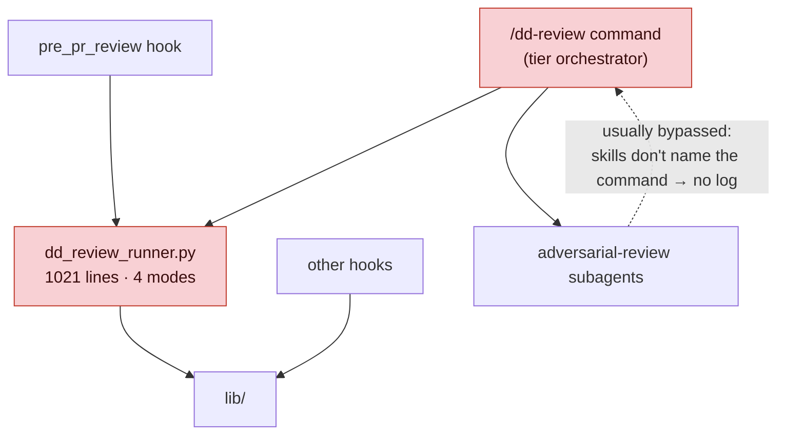
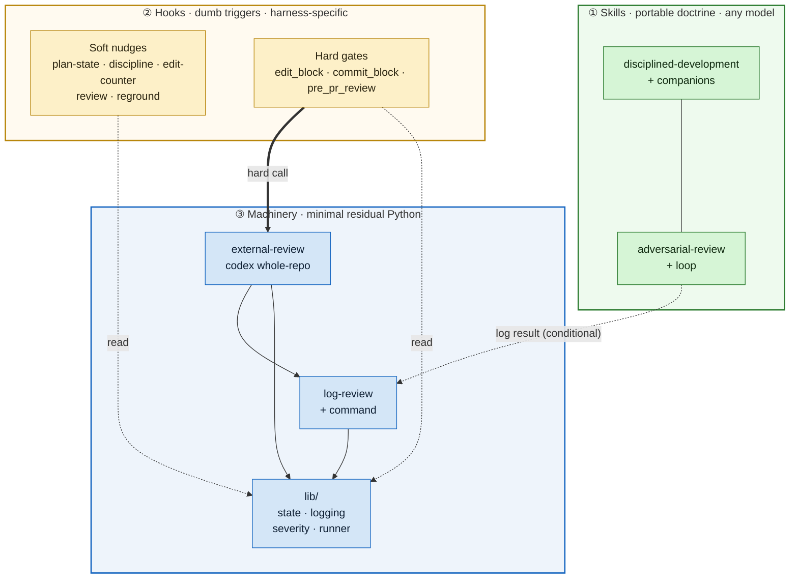
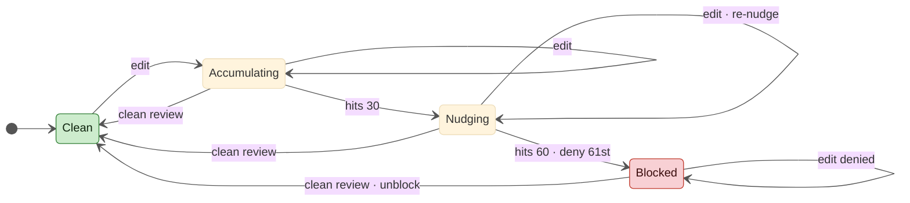
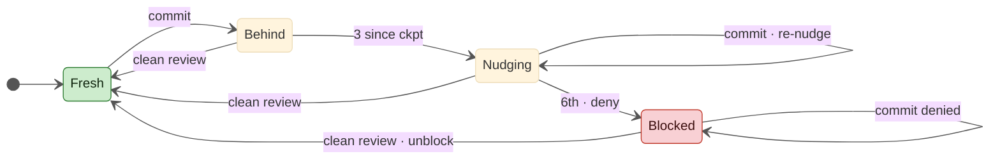
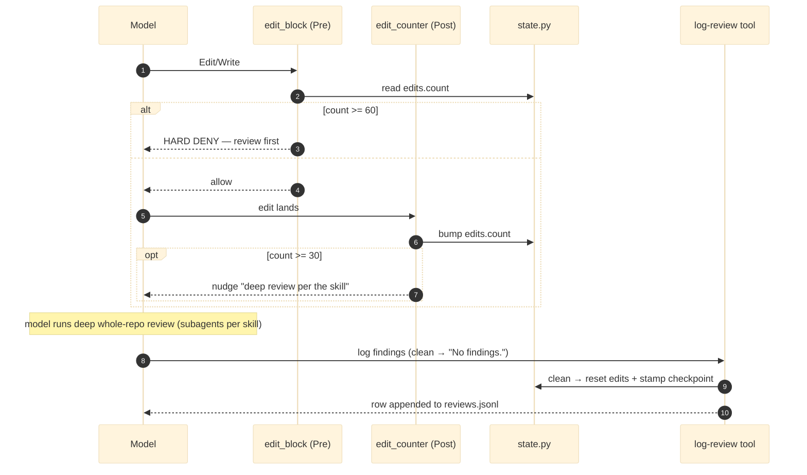
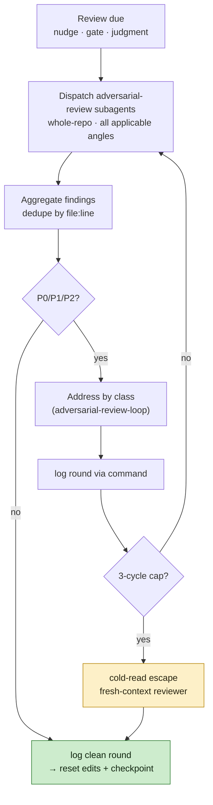
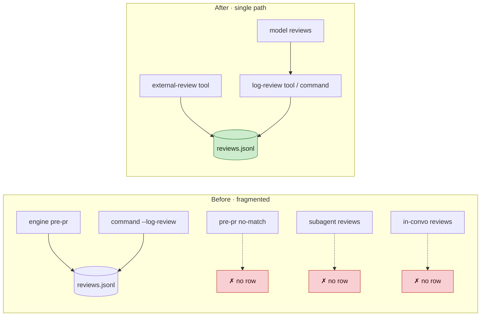

# Proposed Architecture — Review Tooling Overhaul

**Status:** Proposed architecture (design). Pre-implementation. The implementation
plan + merge-boundary task breakdown follow on approval.
**Date:** 2026-06-21.
**Supersedes scope of:** deferred plans #2 (uniform logging) and #3-item-2
(whole-repo cold-read); folds in #1 (pre-PR fail-closed) and the reviewer-declared
verdict long flagged in `severity.py` (Decision 7). Obsoletes most of
`2026-06-10-codex-harness-port.md` (re-scope after this lands).

> **Diagram rendering:** the diagrams use `init` directives + `classDef` colors and
> need a reasonably current Mermaid (GitHub, recent VS Code / JetBrains preview).
> If a renderer chokes on a directive, tell me which and I'll downgrade it.

## North star

A framework that teaches a model a disciplined workflow and uses simple triggers
to keep it from straying. **The model does the work** — and the model can be
Claude, Codex, Gemini, or any other. Three consequences set the architecture:

- **Skills are portable doctrine.** Model-facing, harness-agnostic. They carry the
  discipline and the review posture; they don't depend on scripts.
- **Hooks are dumb, harness-specific triggers.** Soft nudges + a few hard gates.
- **Machinery is minimal.** The only Python that survives is what the hooks
  genuinely need: external review, hook-state generate/update, consistent logging.

The current system is an in-between with cruft from earlier, heavier-handed
attempts — most of it concentrated in a 1021-line review engine. This overhaul
removes that engine entirely and redistributes its two still-needed functions into
small, single-purpose tools built on the surviving primitives.

## Decisions locked

1. **One review mode: deep + whole-repo, plan-anchored.** No light/diff-scoped
   tier. *Why:* shallow scoped reviews save little and push cost into gnarly
   late-stage fix loops, especially once external engines are involved; frequent
   early deep reviews get ahead of that. *Accepted:* each review costs more —
   mitigated by internal reviews running on the subscription and by codex
   navigating the tree rather than ingesting it. Applies to the pre-PR gate **and**
   the deepest internal review.
2. **A clean review resets both counters.** With one mode, every clean review
   resets `edits.count` *and* stamps `review.checkpoint`. No deep/light flag on the
   log-review tool.
3. **The pre-PR gate is fail-closed on every failure.** Unparseable command, codex
   missing / timeout / outage, empty output, git failure → **BLOCK**. The human
   overrides with `DD_SKIP_PR_REVIEW`. *Why:* a gate that fails open is not a gate.
   *Accepted:* an outage blocks PRs until the human bypasses — deliberate (the
   human decides, never the model).
4. **The log is the telemetry *and* the retrospective record.** Two purposes: at-a-
   glance "what is / isn't happening now," and durable input for postmortems /
   retrospectives over time. So it records **every attempt** with rich context —
   outcome, timing, failure reason, what was under review, what triggered it, and
   who/how reviewed — distinguishing *clean* / *blocked* / *attempted-and-failed
   (why)* / *never-ran*. *Bias toward capturing more.* Rows are durable (never aged
   out), append-only, and forward-compatible (sparse by source; readers tolerate
   missing/new fields). Schema in [Logging](#logging-consolidation).
5. **Logging instruction: conditional in the skill, concrete in the harness.** A
   generic degrade-gracefully line in the skill ("if your project provides a
   review-logging command, log through it"); the actual command name lives in
   `CLAUDE.md` / `examples`.
6. **Skill-content edits are drafted via `superpowers:writing-skills` and reviewed
   by the user before they are applied.** *Why:* no test catches a worse
   instruction; skill wording is user-gated. This is a process constraint on the
   implementation plan, resolved at implementation time.
7. **The reviewer declares its verdict; we don't scrape it.** The pre-PR gate's
   PASS/BLOCK comes from a machine-readable verdict the reviewer emits (a final line
   containing only `DD-VERDICT: PASS` or `DD-VERDICT: BLOCK`), parsed deterministically
   from the last non-blank line — not from regex-counting
   `[P0]`–`[P3]` tokens in the reviewer's prose. *Why:* the prose scan's failure mode
   is under-counting a real `[P0]` and silently demoting a BLOCK to a PASS at the only
   hard gate (long flagged in `severity.py`); a declared verdict is robust and is
   "dumb trigger, smart model" applied correctly. *Accepted:* if the verdict line is
   missing/unparseable the gate fails closed (Decision 3). Structured `findings[]` are
   still parsed for the log, but best-effort — a miscount there is harmless retro
   data, not the gate decision. A whole-repo review computes **no diff and no base**,
   so the gate's old base-resolution chain is deleted too.

## Before → after at a glance

| Concern | Now | After |
|---|---|---|
| Review engine | `dd_review_runner.py` (1021 lines, 4 modes) | **deleted** |
| Review trigger command | `/dd-review <tier>` (tier orchestrator) | **deleted** — reviews are model-driven via skills |
| Review modes | 4 tiers (fast / regular / cold-read / pre-pr) | **one mode: deep, whole-repo, plan-anchored** |
| Pre-PR gate executor | engine `pre-pr` (diff-scoped codex) | **external-review tool** (whole-repo codex) |
| Pre-PR failure behavior | fails open on matcher-miss; mixed on errors | **fail-closed on every failure** (human-overridable) |
| Checkpoint / counter writes | engine `--write-checkpoint` + inline pre-pr | **log-review tool** — clean review resets both |
| Review telemetry | 5 fragmented paths; only the gate logs reliably | **single path**; every attempt logged incl. failures |
| Scope resolution / strategy selection | engine `--resolve-scope` / `review_invocation` | **deleted** (one whole-repo mode needs neither) |

### Current (the in-between — the engine is the hub; red = to be deleted)



## Proposed layered architecture



**Reading the layers.** The portable layer never references the machinery directly
except through one optional, gracefully-degrading instruction (Decision 5). The
hooks read state to decide whether to nudge/block; the two tools are the only
writers of state and of the telemetry log. Everything the deleted engine did is
either gone or lives in one of the two tools on top of `lib/`.

## Components

**`lib/` (kept, shared by hooks + tools).** `state.py` (per-branch counters +
`review.checkpoint` + fork-base math), `logging_setup.py` (the single
`reviews.jsonl` writer + hook logs), `severity.py` (`parse_findings` +
`parse_verdict`), `reviewer_runner.py` (subprocess runner for the external model),
plus `config.py`,
`envelope.py`, `plan.py`, `cleanup.py`. Not re-implemented — the engine *called*
these; the new tools call the same code.

**external-review tool (new).** Runs a whole-repo, plan-anchored review with an
external model (codex today). **The tool builds the prompt deterministically** —
pointers to the dd skills + the active plan + "review the repo against this" — so the
gate doesn't depend on the model-under-review to construct it; the hook stays a dumb
trigger that only detects `gh pr create` and delegates. It computes
**no diff and no base** (whole-repo needs neither — finding A). The decision comes
from the reviewer's **declared verdict** (Decision 7), not a prose scan. **Logs
every attempt** (incl. failures) and, on a clean pass, stamps state via the
log-review path. **Fail-closed:** a block verdict, a missing/unparseable verdict, or
any operational failure returns a block. Hook-callable now; a manual command wrapper
can come later.

**log-review tool + thin command (new).** Model-callable. Reads findings, appends
one uniform `reviews.jsonl` row, and on a clean result updates hook state: resets
`edits.count` **and** stamps `review.checkpoint = HEAD` (one behavior — Decision 2).
Replaces the engine's `--log-review` **and** `--write-checkpoint`.

**Hooks (kept, simplified).** Same eight scripts. Two changes only in this phase:
`pre_pr_review` delegates to the external-review tool instead of the engine; all
nudge text stops naming `/dd-review` and instead says "run a deep review per the
skill, then log it." Counters, thresholds, and the three hard blocks are unchanged
here (a later pass may revisit the hook scripts themselves).

> **Rationale (delete, don't slim).** Keeping `dd_review_runner.py` renamed would
> preserve a grab-bag of four unrelated modes. Two single-purpose tools are easier
> to reason about and port to a second harness than one renamed monolith. Accepted
> cost: a wider stale-reference sweep this once.

## State model

Two per-branch files under `<repo>/.claude/.dd-state/<branch-slug>/` (gitignored,
atomic, advisory) — unchanged in shape; only the **writers** change. With one
review mode, a clean review resets **both** (Decision 2).

- **`edits.count`** — unreviewed edits on this branch. Bumped by `edit_counter`
  (PostToolUse). Read by `edit_block` (PreToolUse) and `review_nudge`.
- **`review.checkpoint`** — HEAD SHA at the last clean review. Read by
  `commit_block` and `review_nudge` (commits-since; fall back to fork-base when
  absent/stale).
- **Writers:** the log-review tool on any clean model-driven review; the
  external-review tool on a clean pre-PR pass.

### Edit cadence (`edits.count`) — red = blocked, green = clear



### Commit cadence (`review.checkpoint`) — red = blocked, green = clear



> **Rationale (reset folds into logging).** The hooks keep their hard blocks, so
> something must still reset the counters. Making "log the review" the action that
> also updates state keeps the hooks byte-for-byte the same and gives the model one
> verb after a review. **Accepted:** this preserves today's trust model — the model
> self-reports a clean review to clear a soft gate (a fake `No findings.` would
> clear it too). The soft gates are teeth against drift, not an adversary-proof
> control; the deterministic, fail-closed pre-PR gate is the backstop.

## Lifecycles

### Edit/commit cadence loop



### Model-driven review cycle (the loop)



Reviews are deep and whole-repo; *which* angles to apply is the model's judgment
per `adversarial-review`'s "when to apply." The old tier vocabulary is gone — the
hooks keep numeric thresholds, but they all call for the same one deep review.

### Pre-PR hard gate (deterministic, fail-closed)

```mermaid
%%{init: {'theme':'base','themeVariables':{'fontSize':'14px'}}}%%
sequenceDiagram
    autonumber
    participant M as Model
    participant H as pre_pr_review (Pre Bash)
    participant EXT as external-review tool
    participant CX as codex (external)
    participant LS as log + state
    participant GH as gh pr create

    M->>H: Bash "gh pr create ..."
    H->>H: detect gh pr create (cwd only; no base)
    alt PR-shaped but unparseable (no cwd + looks_like)
        H->>LS: log ERROR (unparseable)
        H-->>M: HARD DENY — override via DD_SKIP_PR_REVIEW
    else parseable
        H->>EXT: whole-repo review vs active plan
        EXT->>CX: codex (skills + plan + repo)
        CX-->>EXT: findings + DD-VERDICT line
        EXT->>EXT: parse declared verdict (+ findings for the log)
        alt verdict = BLOCK
            EXT->>LS: log BLOCK
            EXT-->>H: BLOCK
            H-->>M: HARD DENY — fix findings
        else review failed (timeout / outage / empty / no verdict)
            EXT->>LS: log ERROR (reason)
            EXT-->>H: BLOCK (fail-closed)
            H-->>M: HARD DENY — override via DD_SKIP_PR_REVIEW
        else verdict = PASS
            EXT->>LS: log PASS + checkpoint + reset edits
            EXT-->>H: PASS
            H-->>GH: allow → PR opens
        end
    end
```

> **Rationale (whole-repo, plan-anchored).** A diff-scoped review can't see a
> defect of omission — e.g. a documented-as-required safeguard left with zero
> callers (the incident behind deferred plan #3). Reviewing the repo against the
> plan is what catches it. Cost stays bounded because codex navigates the tree
> itself. The deepest internal review uses the same whole-repo scope (Decision 1).
>
> **Rationale (fail-closed on everything).** The gate's value is that nothing opens
> a PR without a clean review. So *any* failure to produce one — a command shape the
> matcher misses, codex missing / timed-out / in an outage, empty output, or a
> missing/unparseable verdict line — blocks, never allows. The human (not the model)
> overrides via `DD_SKIP_PR_REVIEW` when the cause is an outage they accept.
> *Accepted gap:* detection covers `gh pr create` shapes only — an aliased/wrapped PR
> creation (`hub pull-request`, a custom shell function, tokens hidden in `bash -c`)
> is not caught and would fail open. Covering arbitrary aliases is unbounded
> command-parsing; the model uses `gh pr create` in practice, so this is accepted, not
> closed.

## Logging consolidation



One schema, one writer module (`logging_setup`), two callers. Model-driven reviews
now log (they didn't before unless routed through the deleted command), and **every
attempt logs a row — including failures** — closing the telemetry gap deferred plan
#2 chased, by construction.

**Row schema — one JSON object per line; durable, append-only, forward-compatible.**
Two readers: thin telemetry now, and rich postmortem/retrospective context later
(Decision 4). **Store correlation keys + what git/GitHub doesn't have; derive the
rest.** The review's *outcome* (findings, decision, full reviewer text) and the
framework's *cadence counters* live nowhere else — capture them. Anything
reconstructable from the stored SHAs via git/GitHub (the diff, changed files, churn,
the eventual PR) is **not** duplicated — store `head_sha` + `base` and look it up
later (the same "single source of truth, derive the rest" rule as CLAUDE.md). Rows
are **sparse by source** and readers tolerate missing/unknown fields, so the schema
grows without breaking old data — the drift failure mode the deferred telemetry note
flagged.

| Group | Fields | Why |
|---|---|---|
| **When / correlation** | `ts` (stamped by `append_review`); best-effort `run_id` / `session_id` / `harness` | tie a review (and rounds) to a moment + session; the best-effort three populate only where the harness exposes them (e.g. a future `DD_HARNESS` env, a `--run-id` flag) and are omitted otherwise |
| **Lookup keys** | `repo`, `branch`, `head_sha`, `base` | the keys to reconstruct the diff / changed files / PR from git + GitHub on demand — stored *instead of* the derived churn |
| **Cadence (discipline signal)** | `edits_count`, `commits_since_checkpoint`, `trigger` | the nudge-loop state — not in git: how much had piled up, and what triggered this review (`gate:pre-pr` / `nudge:edits` / `block:*` / `manual` / `model-judgment`) |
| **Reviewer** | `source` (external-gate / model-review), `reviewer`, `model`, `effort`; best-effort `model_version` / `angles` / `skill_version` / `dd_version` | who/how — the best-effort version fields let retros correlate outcomes to a model/skill version |
| **Outcome** | `decision` (PASS/BLOCK/ERROR), `reason` (on ERROR), `p0`–`p3`, `findings[]` (`{severity, file, line, summary}`), `output` (full text) | the whole point — not in git; structured `findings[]` (best-effort parsed) makes recurring classes queryable; `output` is the ground truth |
| **Timing / loop** | `duration_s`, `round`, `cap_hit`, `cold_read_escape` | latency + how the iterate-to-clean loop went |
| **Override** | `bypass` (which `DD_SKIP_*`, if any) | record human overrides of a gate |

We **don't** store `changed_files` / `diff_lines` — derivable from `base..head_sha`
via git, so computing a diff just to log its size would re-introduce the diff-scoped
machinery this overhaul removes. `reason` values (on `ERROR`, best-effort — populate
the one applicable to the failing path, not a closed enum): `unparseable` /
`cli_missing` / `timeout` / `outage` (a flavor of timeout / non-zero exit) /
`empty_output` / `no_verdict` / `git_failed` (state/context git reads). "Never ran" is
the **absence** of a row for a HEAD where one was due — visible against the cadence
state.

## Cleanup surface

- **Delete:** `dd_review_runner.py`; `commands/dd-review.md` (+ the `.claude/`
  copy); `lib/review_invocation.py` and the diff-stuffing parts of
  `lib/review_prompt.py`; the pre-PR **base-resolution chain** — `_gh_merge_base`
  plus the `--base`/`-B` extraction in `find_gh_pr_create` (whole-repo needs no diff
  base — finding A); `severity.py`'s `count_severities` / `findings_excerpt` (the
  count-as-gate-decision path) — the gate decision moves to the declared verdict
  (Decision 7), and a single `parse_findings` (keeping the line-start + rubric-echo
  guard) replaces them for best-effort log counts + `findings[]`. Each deletion
  pending a caller check.
- **Trim config:** keys that only fed the engine — **`review_tiers.pre_pr`** (NOT the
  whole `review_tiers`: `fast`/`regular`/`cold_read_escalation` are read by the
  surviving cadence hooks `edit_block`/`edit_counter`/`commit_block`/`review_nudge`),
  `strategy_selector`, and codex strategy knobs — in `dd-defaults.json`,
  `examples/dd-config.json`, AND `examples/dd-config.full.json`. Keep
  `review.prompt_path` + the codex timeout, and **relocate the gate's `reviewer` /
  `model` / `effort` out of `review_tiers.pre_pr` into a `review.*` block** (the
  external-review gate reads them — they are not engine-only) rather than dropping them.
- **Sweep references (~50):** hook nudge text (`edit_block`, `commit_block`,
  `edit_counter`, `review_nudge`), `CLAUDE.md`, `examples/*`, `README.md`,
  `hook-recipes-claude-code.md`, `dd-config.md`; the dangling pointer in `severity.py`
  to the never-created `2026-05-30-dd-review-severity-verdict-deferred.md`.
- **Rewrite (heavy doc drift, not surgical):** the hook `README.md` review section,
  state model, and CLI-modes table. (There is **no** `dd-review` skill doc — don't
  hunt for one; `SKILL.md` edits are Chunk 4.)

## Merge boundaries (sequencing)

The engine can't be deleted until both its functions have new homes, and all
`SKILL.md` edits are batched last (Decision 6), so:

1. **log-review tool + command + reset-fold + rich log schema.** Foundation.
2. **Pre-PR gate rewrite** → whole-repo, verdict-driven external-review tool;
   fail-closed on every failure; drop the base chain; slim `pre_pr_review`.
3. **Delete the engine + command, sweep references, rewrite the hook docs** (no
   `SKILL.md` edits).
4. **All `SKILL.md` edits, together, last** — conditional logging line, the
   `DD-VERDICT` output contract, tier-vocabulary removal, deep/whole-repo guidance —
   drafted via `writing-skills`, user-reviewed before apply.

Each is one PR-sized branch. The orphaned-safeguard review angle stays a separate
effort (see below).

## Out of scope / follow-ups

- **Skill work — broken out.** The orphaned-safeguard / unwired-contract review
  angle (deferred #3-item-1) is pure `adversarial-review` skill content. Independent
  of this tooling work; tracked separately, still to be done.
- **Hook-script simplification.** A later pass once this lands — the counter
  *structure* (one vs two, hard vs soft) in
  `plans/deferred/2026-06-21-cadence-counters-structure-deferred.md`, and the
  threshold *values* (incl. whether "review earlier / more often" warrants lower
  ones) in `plans/deferred/2026-06-14-threshold-rationale-and-calibration.md`.
- **Codex/other-harness port.** This shrinks the surface a port must cover;
  `2026-06-10-codex-harness-port.md` should be re-scoped or archived afterward.
