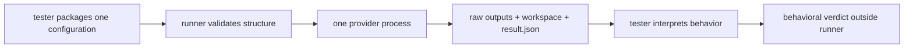
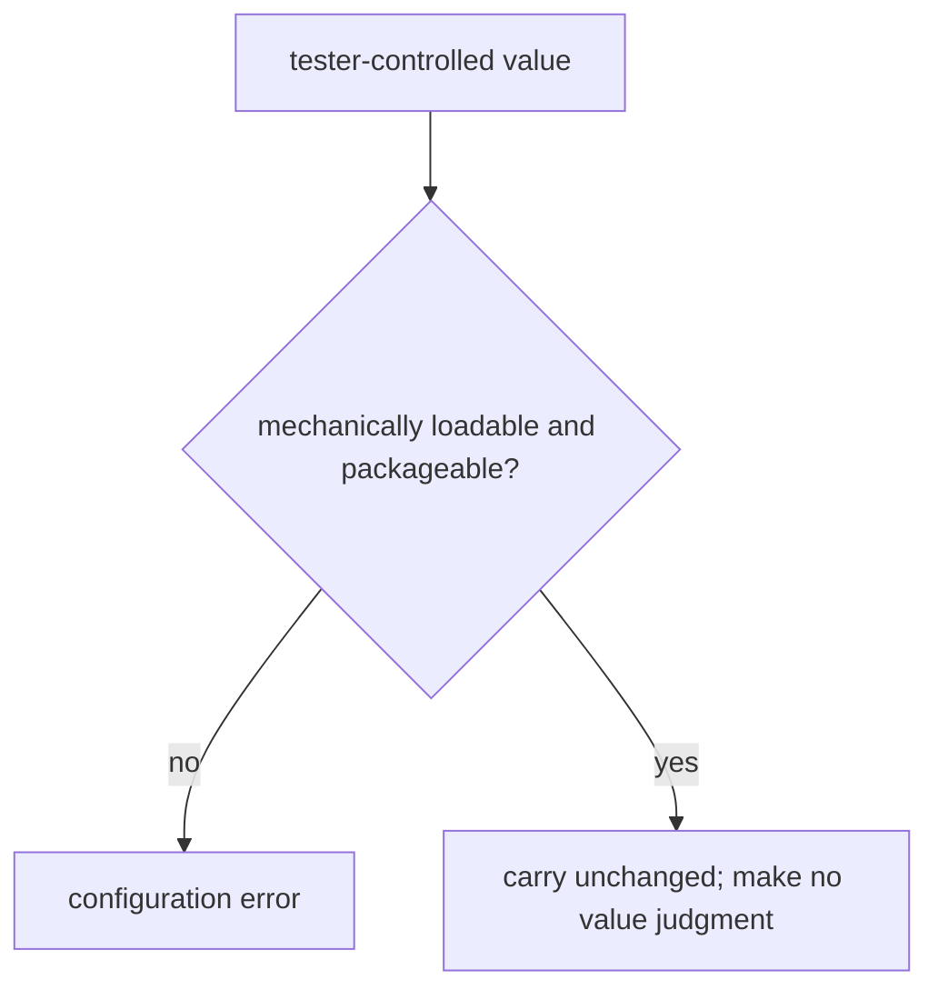
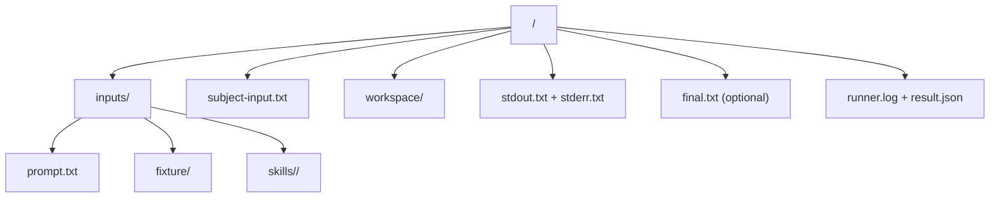
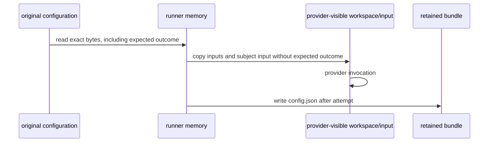
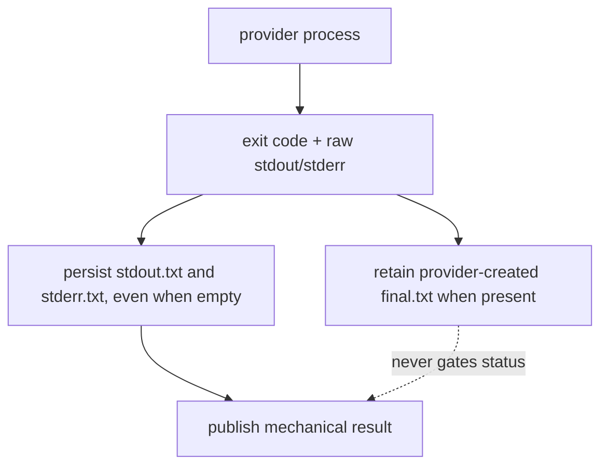
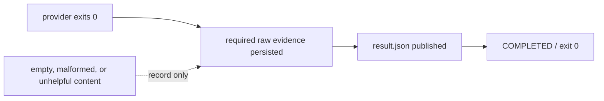
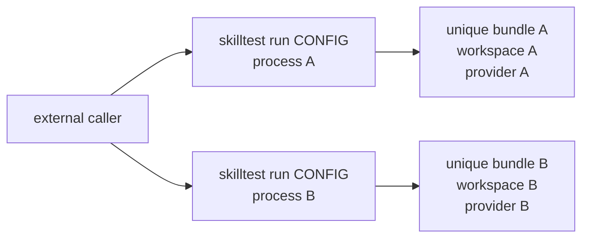

# Single-run skill test runner — design

## Status

Approved by the owner on 2026-08-23 for implementation. Amended during Task 5
to make all tester-controlled content opaque and all provider-output formatting
non-gating. The runner validates and reports mechanics; the tester judges the
test and its result.

The accepted charter at `skill-validation/charter/core-contracts.md` remains the semantic foundation. Its canonical copy is 16,870 bytes with SHA-256 `4d172cfbcda96883a4ebc5fec6462e81545de9b862921f39de69f18eceb74aae`. This work does not change those bytes.

Implementation begins only after the separate implementation plan is reviewed and approved.

## Purpose

`skilltest` is a small, stateless command-line runner used by an agent or person to test skill behavior. It performs deterministic mechanics and preserves inspectable results. It does not decide what should be tested or whether behavior is good.

The core loop is:

1. A tester writes one test configuration.
2. The runner creates one unique run directory and one workspace.
3. The runner prepares the declared skill, dependencies, fixture, and prompt.
4. The runner invokes the configured provider once.
5. The runner retains raw provider output and the workspace directory.
6. The runner writes `result.json` and exits.
7. An agent and owner inspect the run against the withheld expected outcome.

Changing a skill and running the same configuration again produces another independent result for comparison.



## Core guidance: simple, stateless, repeatable, single-scenario

**The runner's only job is to accept one test configuration, prepare one unique local environment for that test, run that test once, save the results, and exit. The runner itself must contain no concurrency machinery.**

One `skilltest run CONFIG` process handles exactly:

- one configuration;
- one scenario;
- one primary skill and its declared dependency skills;
- one workspace;
- one provider invocation;
- one result bundle;
- one exit.

The command is synchronous. Production runner code does not create worker threads, asynchronous tasks, subprocess pools, schedulers, queues, repetition loops, or shared run registries. The provider CLI is the only child process started during a successful run. There is no version-probe subprocess.

To run a test again, invoke `skilltest run CONFIG` again. To collect several stochastic samples, a person, agent, shell, or future orchestration tool launches several independent runner processes. Independent processes may overlap in time because every process owns a unique directory and shares no mutable runner state. The runner itself contains no concurrency feature or awareness of other runs.

This boundary is intentional. External composition gives testers serial runs, parallel samples, and future campaign tooling without putting those responsibilities into the reliable core.

### Stop rule

If a proposed implementation adds concurrency machinery or gives the runner another responsibility, stop before implementing it. Re-read this invariant, identify what requirement supposedly demands the addition, and ask whether the caller, reviewing agent, provider CLI, or a separate future tool already owns it. Continue only when the owner agrees that the behavior is necessary inside one single test run and the specification is amended first.

Examples that trigger the stop rule include threads or asynchronous workers introduced by runner code, a multi-run command, repetitions, queues, shared mutable state, background supervision, adjudication, automatic comparison, scenario selection, environment fleets, or generic workflow execution. A test that starts two independent runner processes does not trigger it because the concurrency belongs to the external test harness, not production runner code.

## Required plan guardrails

Every implementation plan for this runner must place the following two blocks near its top and treat them as global constraints on every task.

### Core guidance

> Build a simple, stateless, repeatable runner for one test scenario. One invocation accepts one configuration, creates one unique local environment, invokes the configured provider once, saves the raw results and workspace, writes one result record, and exits. Running again means starting another independent runner process. The runner contains no concurrency machinery and manages no state across invocations.

### Never do

- Never add internal concurrency: no worker threads, async tasks, pools, queues, schedulers, or multi-run coordination.
- Never add repetitions, retries, resume, campaigns, sampling, batching, or a multi-run command.
- Never add shared or lifecycle-managed state: no counters, indexes, databases, caches, locks, registries, latest pointers, retention state, or cleanup daemon. A unique disposable result bundle is output, not managed application state.
- Never add judgment: no semantic validation of test choices, scoring, grading, behavioral PASS/FAIL, adjudication, automatic comparison, calibration, or recommendations.
- Never add dynamic or test-specific selection policy: the runner does not choose or recommend skills, scenarios, dependencies, providers, models, or efforts. Each adapter applies one fixed, versioned set of permissions, tools, and isolation flags; it does not select them per test.
- Never expose provider mechanics as test configuration. The public execution declaration contains exactly `provider`, `model`, and `effort`; each built-in adapter owns its executable, permissions, tools, timeout, isolation flags, and output mode. Any provider-output formatting is optional packaging and cannot affect status.
- Never add a generic workflow engine: no setup, observer, consumer, evaluator, validation, or post-run command framework.
- Never add project lifecycle behavior: no Git-state checks, repository policy, staging, commits, branches, pushes, approval tracking, or cleanup-project state.
- Never add hidden process machinery: one successful run starts only the configured provider CLI; no probes, helper processes, background supervisors, or descendant discovery.
- Never call provider APIs or SDKs directly; built-in providers invoke their respective fixed local CLI and leave authentication to that CLI.
- Never add speculative hardening for hostile same-user mutation, audit-synchronized races, or unsupported detached writers.
- Never turn the required provider boundary into a plugin system, dynamic registry, fallback chain, or provider lifecycle framework.

Each plan task must include a short guardrail check naming how its deliverable advances the one-run pipeline and confirming that it adds none of the forbidden machinery. If work diverges, stop. Fix the code, task, or contract at the place where it is wrong. If the divergence reveals a reusable gap in these guardrails, update the canonical block in this specification and the plan in the same change, then re-review before continuing. Do not solve drift only at the latest symptom.

## Responsibility boundary

The test configuration is input, not policy. It selects the skill, dependency skills, scenario, expected outcome, provider, model, and effort. If those values are structurally valid, the runner executes them even when the combination appears unhelpful or nonsensical.

Structural validity answers only whether the runner can load, copy, and dispatch
the package. It never answers whether the package describes a meaningful,
useful, or valid test. Empty or nonsensical tester-controlled text is accepted
when its declared type and filesystem packaging are correct.

The runner owns only mechanical work:

- validate the configuration's structure and required files;
- allocate a unique run directory;
- copy declared inputs;
- construct the fixed subject input;
- invoke the named provider once;
- enforce the fixed invocation timeout;
- capture raw outputs and retain the workspace directory;
- log mechanical progress;
- write the versioned result record.

The runner does not:

- select or recommend a skill, scenario, provider, model, effort, or dependency set;
- compare the result with the expected outcome;
- score, grade, adjudicate, or emit a behavioral PASS or FAIL;
- infer whether exact text or an output format matters;
- add checks based on a skill's apparent purpose;
- retry, resume, repeat, sample, calibrate, or run a campaign;
- execute setup, observer, consumer, evaluator, or post-run command lists;
- mutate source skills or project files;
- stage, commit, push, or publish evidence;
- manage approvals, review state, baselines, or skill-cleanup state.

Deterministic output requirements belong in the scenario prompt and expected outcome. If a scenario needs a renderer, validator, or other deterministic tool, the subject may use one during its work or an agent may apply one while reviewing the retained workspace. The runner does not become a workflow engine to host it.



## Test configuration

`skilltest run` accepts one UTF-8 JSON file parsed with Python's standard-library `json` module. The file must be an RFC 8259 object. Version 1 rejects duplicate object keys, `NaN`, `Infinity`, `-Infinity`, and unknown schema keys. This keeps configuration parsing deterministic without adding a parser dependency.

Configuration paths are resolved relative to the JSON file's directory.

The root contains exactly:

| Field | Type | Meaning |
|---|---|---|
| `schema_version` | integer `1` | Configuration schema version. |
| `id` | path-safe string | Stable test identifier for humans and results. |
| `skill` | skill declaration | Primary skill under test. |
| `dependencies` | list of skill declarations | Ordered supporting skills; may be empty. |
| `scenario` | scenario declaration | Prompt and optional starting workspace. |
| `expected_outcome` | any JSON value | Withheld material for agent and owner review; opaque to the runner, including when null. |
| `execution` | execution declaration | Provider, model, and effort. |

Identifiers are 1–64 characters matching `[a-z0-9][a-z0-9-]{0,63}`. The bound keeps every identifier-derived path component within ordinary filesystem limits. A skill declaration contains exactly `id` and `source`. `source` names a directory containing a regular `SKILL.md`; the whole directory is supplied so referenced scripts, assets, and supporting files remain available. Skill identifiers are unique across the primary skill and dependencies.

Each skill source is independent and may name any local repository, worktree, or directory. The runner does not require a common root or inspect Git state. A tester swaps the primary skill or any dependency by changing that declaration's `source`; the runner copies the configured combination without judging it.

The scenario declaration contains exactly:

| Field | Type | Meaning |
|---|---|---|
| `id` | path-safe string | Scenario identifier recorded in the result. |
| `prompt` | path | Regular UTF-8 file containing the subject-visible prompt; it may be empty or nonsensical. |
| `fixture` | path or `null` | Directory whose contents become the workspace root. |

The execution declaration contains exactly:

| Field | Type | Meaning |
|---|---|---|
| `provider` | `codex` or `claude` | Built-in provider selected by the test author. |
| `model` | non-empty string | Passed to the provider without runner interpretation. |
| `effort` | string matching `[a-z0-9][a-z0-9-]*` | Passed to the provider without semantic interpretation; the restricted alphabet is safely representable in the pinned Codex TOML argument. |

The execution declaration contains exactly those three fields for every provider. Executable selection, timeout, permissions, sandboxing, tool availability, isolation flags, and output format are adapter constants, not test-plan options.

```json
{"provider": "claude", "model": "sonnet", "effort": "high"}
```

The expected outcome field is required but mechanically opaque. It may be any
JSON value, including null. The runner validates only that the field is present,
preserves it through the original configuration bytes in the post-run snapshot,
and never stores or recursively transforms it in runtime state. It is never
passed to the provider.

## Ordinary filesystem validity

Inputs are local, trusted test definitions in the DD skill repository, tested directly against development source directories; installer-created consumer skill symlinks are outside runner scope. Before allocating a run directory, the runner performs structural preflight and rejects:

- an absent required path;
- a path of the wrong kind;
- a `source` directory without a regular `SKILL.md`;
- a duplicate identifier;
- unreadable or invalid UTF-8 prompt or `SKILL.md` content;
- a special file beneath a supplied skill or fixture;
- a resolved configuration path equal to the prompt or contained by a skill or fixture directory;
- any non-regular entry in a declared input path or beneath a supplied skill or fixture;
- the fixed run base overlapping the configuration directory, a skill source, or the fixture in either direction.

The overlap checks prevent the runner from directly copying the original configuration—and therefore the withheld expected outcome—into provider-visible input. They do not scan unrelated file content for deliberately repeated expected-outcome material; content chosen by the test author remains the author's responsibility.

Other skill and fixture files are ordinary files copied as bytes. Empty supporting files and empty fixture directories are valid. File modes are copied using the standard library's ordinary copy behavior; mode normalization is not part of the result contract.

An empty prompt and semantically odd skill, dependency, model, effort, prompt,
fixture, or expected outcome are valid when their declared types and packaging
meet the mechanical contract. The provider, not the runner, reports whether a
passed-through execution value is accepted by its CLI.

Any I/O failure discovered during preflight is invalid input: exit `2`, with no run directory. Once the atomic temporary-directory call returns, the runner owns that directory even if marker or fixed-layout initialization then fails. An environmental copy or write failure after ownership but before provider launch is `PREPARATION_FAILED`; a required artifact write failure after launch is `ARTIFACT_WRITE_FAILED`. Both exit `1`, print the owned path, and retain a best-effort bundle. Only fixed-root creation or the atomic directory-allocation call itself may fail without an owned path.

The runner assumes the caller does not modify the configuration, skills, prompt, or fixture while a run is copying them. It does not use audit hooks, inode pinning, descriptor-relative traversal, filesystem watchers, timing barriers, locks, rollback transactions, or post-copy source reconciliation. Same-user adversarial mutation is outside the tool's trust model. This accepted limitation keeps the tool proportional to local agent-assisted testing; if real use exposes a violated assumption, that observed case can justify a smaller targeted change.

## Run directory and preparation

Runs live under the fixed disposable root `${TMPDIR}/skilltest-runs/`. Preflight resolves that root and rejects it if it overlaps the configuration directory, a skill source, or the fixture in either direction. The check is filesystem-based and does not query Git state. It keeps run bundles outside declared test inputs, so they need no project ignore rule and provider project discovery cannot walk from the workspace into those inputs. Each invocation uses an atomic temporary-directory primitive to create a directory named with a UTC timestamp, the test identifier, and a random UUID. It never scans for the next number and never coordinates with another invocation.

Run bundles are disposable results, not evidence or application state. The fixed run root is safe to delete when no runner process is active. Promotion, when added after the core, copies a selected completed bundle to an explicit evidence destination.

The run directory is the retained result bundle; there is no staging tree or later workspace copy. Its fixed layout is:

```text
<run-id>/
  .skilltest-run
  config.json
  inputs/
    prompt.txt
    fixture/
    skills/<skill-id>/...
  subject-input.txt
  workspace/
    supplied-skills/<skill-id>/...
    ...fixture contents...
  stdout.txt
  stderr.txt
  final.txt
  runner.log
  result.json
```



After atomic allocation establishes ownership, preparation creates the marker and fixed directories first. Declared input bytes are copied into `inputs/`, then the workspace is prepared from that retained copy. The contents of `inputs/fixture/`, not the directory itself, become the workspace root. An absent fixture produces an empty retained fixture directory and otherwise empty workspace before supplied skills are added.

Every primary and dependency skill is copied to `workspace/supplied-skills/<id>/`. The fixture may not contain `supplied-skills`; this avoids an ambiguous overwrite rule.

The runner reads the configuration bytes once before validation and retains those bytes in memory. It writes the same bytes to `config.json` only after the provider attempt is over, or after preparation fails without starting the provider. Until then, the expected outcome exists only in runner memory and the original caller-selected configuration file. It is absent from the subject input, copied inputs, workspace, environment additions, and provider arguments. This is withholding for normal test operation, not an operating-system confidentiality boundary: a provider running as the same user could search outside its workspace. The accepted boundary is appropriate because the runner facilitates evaluation rather than defending against a malicious subject.



## Subject input

The runner constructs `subject-input.txt` from this exact five-line UTF-8 preamble followed immediately by the exact prompt bytes:

```text
For skill instructions, use only the supplied files listed below.
Primary: <primary-id> — supplied-skills/<primary-id>/SKILL.md
Dependencies: <dependencies>
Read those files before acting.
Scenario follows:
```

The preamble uses LF endings and ends with one LF. `<dependencies>` is `none` when the list is empty. Otherwise it is each `id — supplied-skills/<id>/SKILL.md` entry joined by `; ` in configuration order. No extra separator, output instruction, expected outcome, or evaluator guidance is inserted before the prompt bytes.

The complete subject input is saved before invocation. The provider receives those exact bytes on standard input.

## Provider boundary

Provider abstraction is a core requirement. Provider, model, and effort are test inputs, and provider CLIs have different invocation contracts. Keeping translation behind one small boundary prevents provider mechanics from leaking into the test configuration or preparation code:

- a provider request contains the workspace, subject-input bytes, provider, model, effort, and the final-output path required by the adapter;
- a provider result contains whether invocation started, exit code, timeout state, launch error, and raw stdout and stderr bytes;
- one built-in provider implementation translates the request into one direct CLI invocation;
- the runner selects the built-in implementation named by `execution.provider`.

The adapter owns provider-specific argument construction. Codex receives the
`final.txt` path directly and the runner retains the file when Codex creates it.
Claude's stream remains raw JSONL in `stdout.txt`; Version 1 does not parse it or
manufacture a final response. `final.txt` is optional convenience evidence and
its absence or content never affects status. The linear runner writes the raw
stdout and stderr bytes returned by `ProviderResult` exactly once.

There is no dynamic plugin discovery, entry-point loading, provider package API, fallback chain, or generalized adapter framework. The boundary may be a protocol plus plain request/result records; it does not justify a registry hierarchy or lifecycle framework. Version 1 implements built-in Codex and Claude Code providers.

The runner calls providers through an argument list without a shell. The Codex adapter launches `codex`; the Claude adapter launches `claude`; both resolve through inherited `PATH`. Offline tests provide fake executables through a test-only `PATH`, not through test configuration. The provider runs with `workspace/` as the process working directory and, where supported, the declared CLI working root. It inherits the parent environment so installed CLI authentication continues to work, but the runner does not add the original repository, source paths, configuration path, or expected outcome to the child environment.

### Codex provider

The Codex argument order is:

1. `codex`;
2. global `--ask-for-approval never`;
3. global `--search`;
4. global `--cd <workspace>`;
5. `exec`;
6. `--strict-config --ignore-user-config --ignore-rules --ephemeral --skip-git-repo-check`;
7. `--json --color never`;
8. `--model <model>`;
9. `-c` followed by the single argument `model_reasoning_effort="<effort>"`;
10. `--sandbox workspace-write`;
11. `--output-last-message <absolute-run-directory>/final.txt`;
12. `-`, instructing Codex to read the subject input from standard input.

The quote characters around `<effort>` are part of the single `key=value` argument; no shell quoting is involved. Version 1 targets `codex-cli 0.149.0`. Global flags precede `exec` because that version rejects them at the exec level. `--skip-git-repo-check` is required because a fixture need not be a Git repository.

`--ignore-user-config` and `--ignore-rules` reduce host configuration drift. Web search and workspace writes are always available; the scenario and supplied skill decide whether to use them. These are adapter behavior, not configuration choices. The runner does not claim to erase provider-owned global instructions, system prompts, authentication state, service changes, or model stochasticity. Repeatability here means identical mechanical preparation and invocation from the same declared inputs and external environment, not identical model output.

### Claude Code provider

The Claude Code argument order is:

1. `claude`;
2. `--print`;
3. `--safe-mode`;
4. `--no-session-persistence`;
5. `--no-chrome`;
6. `--input-format text`;
7. `--output-format stream-json`;
8. `--verbose`;
9. `--model <model>`;
10. `--effort <effort>`;
11. `--allow-dangerously-skip-permissions`;
12. `--permission-mode bypassPermissions`.

With no prompt argument, `--print` reads the subject input from standard input. The process working directory is `workspace/`; Claude Code has no separate working-directory flag in this invocation.

`--safe-mode` disables project and user customizations, including automatic `CLAUDE.md`, skill, plugin, hook, MCP, command, and agent loading, while retaining normal authentication, model selection, built-in tools, and permissions. The supplied skill remains available through the subject envelope and copied workspace files. `--no-session-persistence` prevents resumable session state. Bypass permission mode lets the non-interactive invocation use built-in tools without a prompt. The external workspace limits project discovery but is not an operating-system sandbox; same-user host access remains an accepted trust-model limit. These are fixed adapter mechanics. Version 1 targets Claude Code 2.1.241.

Claude Code emits line-delimited JSON on stdout. The adapter returns those exact
bytes without parsing, validation, extraction, or normalization. Empty output,
malformed JSONL, absent result events, unusual event ordering, and arbitrary
result values are retained facts for the tester; none is a runner error.

Building and offline-testing this provider is part of Version 1. Running a Claude model, calibrating Claude results, or beginning cross-model evaluation still requires fresh owner permission.

## Process lifecycle

The runner uses one synchronous process call that sends stdin and drains stdout and stderr without runner-created worker processes or threads. Raw stdout and stderr are written once to `stdout.txt` and `stderr.txt`; they are not duplicated line-by-line into the runner log. Version 1 applies a fixed 900-second wall-clock timeout to either provider.



On timeout, the runner terminates the provider, waits a fixed five-second grace period, then kills it if necessary. It does not install custom signal handlers, supervise descendants, or discover detached processes. The timeout guarantee assumes the provider closes its inherited pipes; a detached descendant that holds them open is unsupported. External interruption follows the operating system and Python defaults and may leave a marked partial run or live child; Version 1 makes no normalized result or exit-code promise for interruption.

The retained `workspace/` is a live directory, not a point-in-time snapshot. For ordinary scenarios it contains the state left when the direct provider process exited, but the runner makes no stability guarantee after that boundary. A scenario or provider that leaves a detached writer makes later workspace comparison unreliable; the runner neither detects nor prevents that unsupported behavior and may still record `COMPLETED`. This accepted limitation avoids turning the single-process runner into a process supervisor. Tests and comparisons that require stable workspace evidence must use scenarios that leave no background writers.

## Logging and result contract

`runner.log` is a plain UTF-8 chronological log for mechanical debugging. It
records the run identifier, input-copy milestones, provider argument list,
invocation attempt before the synchronous provider call, provider return or
timeout after that call, artifact writes, and terminal runner status. It never
claims an OS process started before launch is known, and it does not copy prompt,
stdout, stderr, final response, expected outcome, or credentials into the log.

The runner writes `result.json` last using a temporary file in the run directory followed by atomic replacement. Result construction, retained-file traversal, digest reads, encoding, temporary-file writing, and replacement share one persistence-failure boundary so ordinary failures return an exit-1 diagnostic rather than a traceback. A tracked JSON Schema is the executable Version 1 authority, and offline tests validate generated results against it. The production runner does not load a schema engine at runtime. The schema contains exactly these root fields:

| Field | Meaning |
|---|---|
| `schema_version` | Integer `1`. |
| `run_id` | Unique directory identifier. |
| `status` | `COMPLETED` or `INFRA_ERROR`. |
| `started_at`, `finished_at` | UTC RFC 3339 timestamps. |
| `duration_seconds` | Owned-run duration from the allocation attempt through result construction. |
| `test` | Exact test record defined below. |
| `execution` | Exact execution record defined below. |
| `inputs` | Exact input records defined below, sorted by relative path. |
| `artifacts` | Exact artifact record defined below. |
| `infrastructure_error` | `null` or a fixed code and diagnostic message. |

`test` contains exactly `id` (string), `skill` (string), `dependencies` (ordered string array), and `scenario` (string). `execution` contains exactly `provider`, `model`, and `effort` copied from configuration; `executable` as the adapter-selected `codex` or `claude`; fixed integer `timeout_seconds: 900`; `invocation_started` and `timed_out` as booleans; and `exit_code` as an integer or `null`.

Each `inputs` item contains exactly `path`, `bytes`, and `sha256`. `path` is run-relative; `bytes` is a non-negative integer; and `sha256` is a lowercase 64-character hexadecimal digest. Records cover every ordinary file beneath `inputs/` and sort lexically by `path`. Digests are streamed from retained bytes and identify evidence; they do not interpret it.

`artifacts` contains exactly `config`, `subject_input`, `stdout`, `stderr`, `final`, and `workspace`. The five file entries each contain exactly `path`, `exists`, `bytes`, and `sha256`; their fixed paths are `config.json`, `subject-input.txt`, `stdout.txt`, `stderr.txt`, and `final.txt`, and size and digest are null when a file does not exist. `workspace` contains exactly `path` and `exists`. The workspace is retained directly and is not converted into a second manifest or snapshot.

`runner.log` and `.skilltest-run` have fixed paths but are not hashed inside `result.json`. The log receives the terminal status before successful result publication and may receive a publication-failure diagnostic after an unsuccessful attempt; hashing it would create write-order coupling. The marker has no evidentiary content.

`infrastructure_error` is null for `COMPLETED`; otherwise it contains exactly `code` and `message` strings. Timestamps use UTC with millisecond precision in `YYYY-MM-DDTHH:MM:SS.sssZ` form. Duration is a non-negative number rounded to milliseconds. The JSON Schema rejects unknown fields at every object level.

Fixed persisted infrastructure error codes are `PREPARATION_FAILED`,
`PROVIDER_LAUNCH_FAILED`, `PROVIDER_TIMEOUT`, `PROVIDER_EXIT_NONZERO`, and
`ARTIFACT_WRITE_FAILED`. Diagnostics describe mechanics only and never
characterize provider content. Provider launch failures include failures before
the child starts, such as a missing executable or an argument the operating
system cannot represent. A failure to construct or write `result.json` is
reported through standard error and `runner.log`; by definition it cannot be
represented inside that missing record.

When several mechanical symptoms accompany one attempt, classification follows
execution order: preparation failure before launch; launch failure; timeout
regardless of eventual process code; nonzero provider exit; then failure to
write required evidence or the result. The runner records the first applicable
code and does not infer a cause beyond that observation.

Provider stdout, stderr, and `final.txt` may be empty, and `final.txt` may be
absent. Non-empty stderr does not imply failure. After a zero provider exit,
provider-output bytes and structure cannot change `COMPLETED` to `INFRA_ERROR`.
The tester interprets all retained content.



## CLI output and exits

The Version 1 command is:

```text
skilltest run CONFIG
```

Progress and diagnostic messages go to standard error and `runner.log`. On any normal runner exit after a run was created, standard output prints the absolute run-directory path as its final line so an agent or shell can locate the bundle. External interruption has no output guarantee.

Exit codes are:

- `0`: the provider exited zero, required raw evidence was retained, and `result.json` records `COMPLETED`;
- `1`: a structurally valid request encountered run allocation, preparation, provider execution, or result persistence failure;
- `2`: CLI usage or configuration validation failed before a run directory was created.

Exit `0` says the mechanical run completed. It says nothing about whether the skill behaved correctly.

If fixed-root creation or unique-directory allocation fails after successful preflight, the runner exits `1`, writes the diagnostic to standard error, and produces no bundle or stdout path because no owned directory exists.

## Rerun independence

Every run has fresh copied inputs and a fresh workspace. The runner does not read prior run directories or maintain counters, indexes, databases, caches, lock files, latest pointers, or campaign metadata. The fixed parent directory is the only shared runner path; unique directory creation is the only coordination primitive.

The implementation must prove independence two ways:

- running the same configuration twice serially produces two complete, separately inspectable bundles;
- a test harness launches two `skilltest run` OS processes simultaneously against a fake provider executable and both complete in distinct directories without production concurrency code.

The second test puts concurrency outside the runner, matching real use. It does not authorize a multi-run command or in-process parallelism.



## Test strategy and size tripwires

Implementation is test-driven. Each behavior begins with a failing test, then the minimum production change, then refactoring while green. Tests use a real fake-provider executable as the single child process; mocks must not substitute for the subprocess boundary.

The focused offline suite covers:

- valid and invalid configuration structure;
- one unique run directory and retained input copy;
- exact fixture and supplied-skill workspace preparation;
- exact subject-input bytes;
- exact Codex and Claude Code argument order and stdin;
- success, nonzero exit, missing executable, and timeout;
- completed zero-exit runs with empty, malformed, or otherwise arbitrary provider output and no final-output file;
- raw output, log, and `result.json` persistence;
- truthful allocation ownership and invocation-attempt chronology;
- complete independently enumerated input manifests and streamed digests;
- serial rerun and externally launched simultaneous-process independence;
- proof that expected outcomes never enter provider-visible runner additions.

Installed-CLI checks verify the targeted executable versions and required flag availability or placement through version and help commands that cannot invoke a model. Real fake executables prove the exact pinned inference argument lists and stdin behavior. After the offline suite and owner review are clean, one announced, owner-approved Sol-low live smoke may spend model tokens. A Claude live smoke and Claude result calibration remain deferred and require fresh owner permission.

The expected core is roughly 300–500 production lines and 15–25 focused tests. These are drift tripwires, not quality targets. If the core exceeds 600 production lines, 30 focused tests, six implementation tasks, one working day, or one necessary child process per successful run, implementation stops for owner review. The remedy is to remove machinery or rewrite the task, not rationalize the growth.

Tests do not introduce audit-hook races, timing-barrier protocols, hostile concurrent source mutators, a fake filesystem framework, or exhaustive OS-failure simulation. Add regression coverage for an observed public failure, not every imaginable environmental fault.

## Deferred conveniences and separate work

The first implementation branch delivers only `skilltest run`. After that core is accepted, a small follow-up may add:

- `skilltest promote RUN DEST`, which copies one completed run bundle to an explicit destination without judging, staging, committing, or overwriting it;
- `skilltest clean RUN`, which deletes one explicitly named, marked run beneath the fixed run root, with no bulk, age, retention, daemon, or pruning policy.

These commands follow core acceptance so they cannot delay or expand `run`.

Scenario migration, baseline collection, skill sharpening, Claude live evaluation, cross-model calibration, multi-run orchestration, campaigns, dashboards, automatic comparison, hooks, and legacy validation cleanup are separate later branches. None may expand the single-run core. A future orchestration tool may invoke this CLI many times; it must not turn this CLI into an orchestrator.

## Acceptance

The first implementation is acceptable only when all of the following are true:

- one command reads one valid configuration, creates one unique directory and workspace, invokes the configured Codex or Claude Code provider once, retains raw outputs and the live workspace directory, writes the exact result contract, and exits;
- the runner executes structurally valid but semantically odd configurations without judgment;
- empty prompts and null expected outcomes are structurally valid;
- a zero-exit provider run completes regardless of empty, malformed, or otherwise arbitrary output content and regardless of whether `final.txt` exists;
- expected outcomes are retained for reviewers but not directly copied by the runner into subject input, workspace preparation, provider arguments, or runner-added environment values;
- provider, model, and effort come from the configuration and are recorded exactly;
- fake executables prove both provider contracts and the exact single-invocation boundary without model cost;
- serial and externally simultaneous invocations remain independent;
- no production concurrency, repetition, adjudication, workflow, campaign, Git-state, or project-state machinery exists;
- the size tripwires hold or the owner explicitly approves a smaller justified exception before work continues;
- for scenarios without background writers, an agent and owner can inspect two bundles and judge the behavioral impact of a skill change without knowing runner internals.
