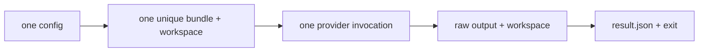
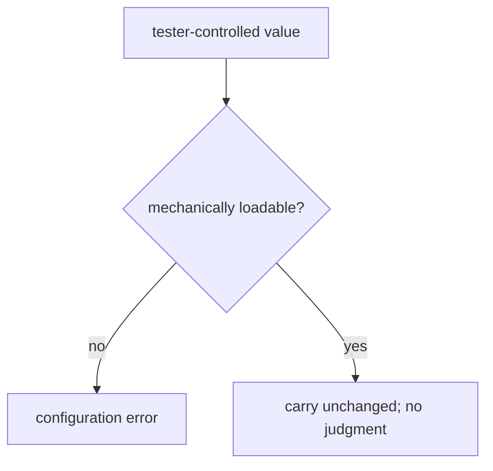
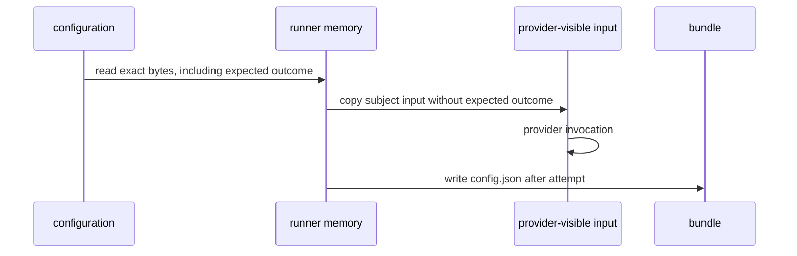
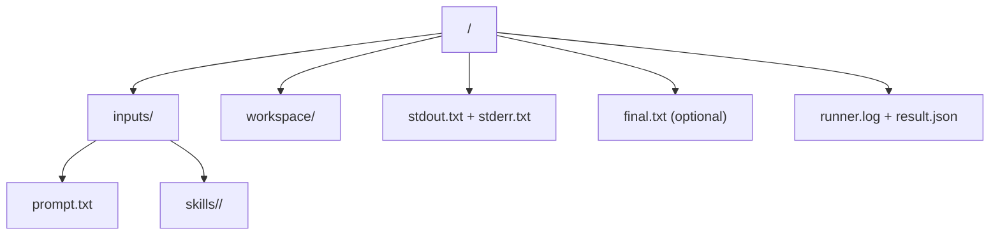
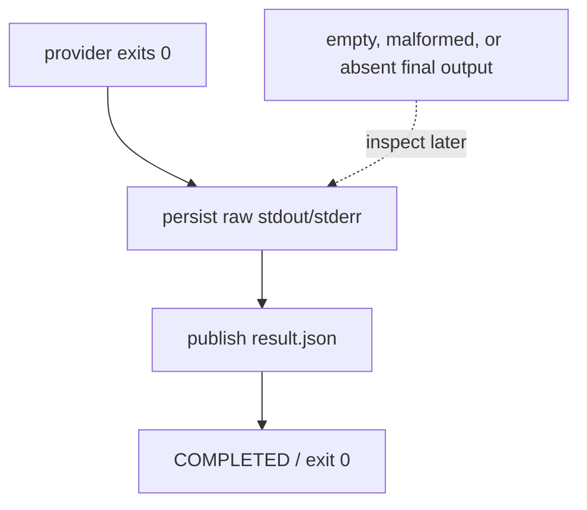
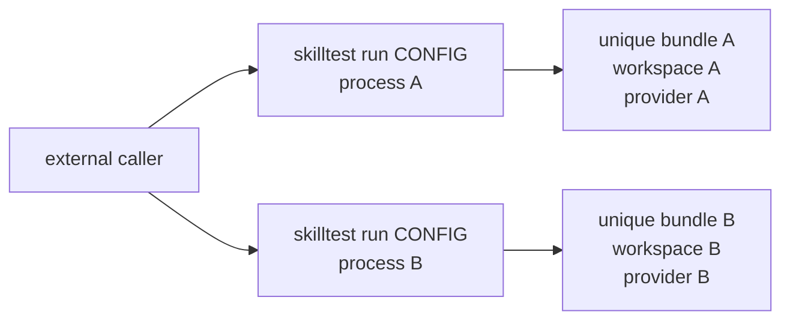

# skilltest

`skilltest` runs one local skill-test configuration, retains its bundle, and
does not judge the provider response. Its sole command is:

```text
skilltest run CONFIG
```

## Run from a clean checkout

```text
cd skill-validation/runner
uv sync --locked
uv run skilltest run /absolute/path/to/test.json
```

The final standard-output line is the owned absolute bundle path. Exit `0`
means mechanics completed; exit `1` means an owned-run, provider, or persistence
failure; exit `2` means usage or configuration failed before allocation.





## Configuration

Paths are relative to the JSON file. `expected_outcome` is required but opaque,
including when `null`; only `provider`, `model`, and `effort` configure
execution. There are exactly two mutually exclusive root shapes. The ordinary
skill shape is:

```json
{
  "schema_version": "0.1",
  "id": "draft-check",
  "skill": {
    "id": "primary",
    "source": "skills/primary",
    "include": ["SKILL.md", "scripts/tool.py"]
  },
  "dependencies": [
    {"id": "helper", "source": "skills/helper", "include": ["SKILL.md"]}
  ],
  "scenario": {"id": "empty-doc", "prompt": "prompt.txt", "fixture": null},
  "expected_outcome": null,
  "execution": {"provider": "codex", "model": "gpt-5.4", "effort": "medium"}
}
```

The explicit no-skill-context shape has no `skill` or `dependencies` fields:

```json
{
  "schema_version": "0.1",
  "id": "description-only-check",
  "skill_context": "none",
  "scenario": {"id": "descriptions", "prompt": "prompt.txt", "fixture": "fixture"},
  "expected_outcome": null,
  "execution": {"provider": "codex", "model": "gpt-5.4", "effort": "medium"}
}
```

Null skill fields, untagged omissions, any value other than `"none"` for
`skill_context`, and mixtures of these shapes are invalid.

Each skill declaration requires a non-empty `include` list of unique relative
regular-file paths, including root-level `SKILL.md`. Only those files are copied.
`prompt.txt` is a regular UTF-8 file and may be empty.



## Bundle and interpretation

Bundles live under `${TMPDIR}/skilltest-runs/` and retain copied inputs,
`workspace/`, `stdout.txt`, `stderr.txt`, optional `final.txt`, `runner.log`,
and `result.json`. Rerun the same command for a fresh, independent bundle. In
the no-skill-context shape, `inputs/skills/` and `workspace/supplied-skills/`
are absent: the workspace contains only the copied fixture, and the provider
receives the prompt bytes unchanged (with no skill preamble).





The runner never scores a test or parses provider output into a verdict. Inspect
the retained raw outputs and workspace against the withheld expected outcome
outside the runner.

`result.json` preserves the ordinary test record as `id`, `skill`,
`dependencies`, and `scenario`. A no-skill-context run instead records exactly
`id`, `skill_context: "none"`, and `scenario`; it does not use null skill
metadata.


