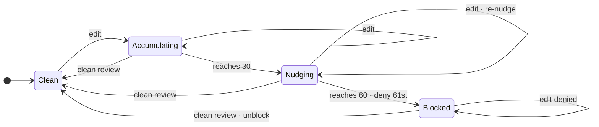
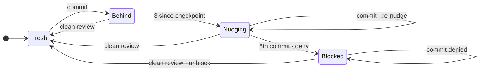

# disciplined-development hook stack — design

The durable "why" for the hook layer that scaffolds the
`disciplined-development` skill.

## What this is

A minimal set of Claude Code hooks + two model-callable tools that keep
the model on-track without continuous human steering. The hooks are
**model-facing**: the consumer of every signal is Claude, not the user. The
user is the architect; the discipline layer keeps the model honest during long
autonomous stretches.

Design ethos — **dumb triggers, smart model.** A hook fires on a concrete
boundary (a tool call, a commit, a PR open, a session resume) and emits a
fixed, actionable nudge. It does **not** inspect the model's work to decide
*what* to say — that "scan output to classify a smart agent's work" pattern
has unbounded edge cases and trains tune-out (see the spec's "nudge, never
police"). The intelligence stays in the model; the hook just marks the moment.

## Hook table

Eight hook scripts (one event entry each) plus two model-callable tools.
**Three hard blocks, zero kicks** — everything except the edit-count ceiling,
the commit ceiling, and the pre-PR gate is an advisory nudge.

| Hook | Event | Matcher | Behavior | Bypass |
|---|---|---|---|---|
| `inject_plan_state.py` | UserPromptSubmit | — | Surface the active plan + checkbox progress + next pending task; reset the per-turn discipline counter; run throttled housekeeping. | `DD_SKIP_INJECT_PLAN_STATE` |
| `discipline_nudge.py` | PreToolUse | `*` (all) | Count tool-calls since the last re-ground; at the threshold emit a "re-read CLAUDE.md + the plan, re-check the skills" nudge and reset. | `DD_SKIP_DISCIPLINE_NUDGE` |
| `edit_block.py` | PreToolUse | `Edit\|Write` | **Hard block.** Deny when stored `edits.count` ≥ 60 (i.e. the 61st edit). Reads only; never increments. | `DD_SKIP_EDIT_BLOCK` |
| `commit_block.py` | PreToolUse | `Bash` (`is_git_commit`) | **Hard block.** Deny a `git commit` (incl. `--amend`) when commits-since-last-deep-review ≥ 5 — allows 5, denies the 6th. | `DD_SKIP_COMMIT_BLOCK` |
| `pre_pr_review.py` | PreToolUse | `Bash` (`gh pr create`) | **Hard gate.** Detect → resolve cwd → delegate to `external_review.py --cwd`. Any non-zero result maps to exit 2. No base resolution; no `DD_HARD_BLOCK`. An unparseable chained `cd` logs an ERROR row and blocks rather than letting an unreviewed PR through. | `DD_SKIP_PR_REVIEW` |
| `edit_counter.py` | PostToolUse | `Edit\|Write` | Increment `edits.count`; emit a nudge on each edit once the stored count reaches 30, continuing until a clean review resets the counter via `dd-log`. Advisory only — PostToolUse runs after the edit. | `DD_SKIP_EDIT_COUNTER` |
| `review_nudge.py` | PostToolUse | `Bash` | On a landed commit: always emit a Gate-3 **verify** reminder; also a nudge when `edits.count` ≥ 30; also a nudge when commits-since-last-deep-review ≥ 3. | `DD_SKIP_REVIEW_NUDGE` |
| `session_reground.py` | SessionStart | — | On every session (re)start, emit a source-specific preamble + shared re-ground instructions. Fires on all sources (startup/resume/clear/compact); unknown source fires with a generic preamble. | `DD_SKIP_SESSION_REGROUND` |

Gate 3 (verify before "done") rides the **post-commit verify nudge**, not a
Stop kick: the commit is where an edit becomes an assertion that owes
verification, and PostToolUse reaches the model without a Stop hook's
block-or-be-silent constraint.

**Boundary note (PreToolUse reads / PostToolUse writes).** `edit_counter.py`
increments `edits.count` after each edit (PostToolUse). `edit_block.py` reads
the stored value before the next edit (PreToolUse). A stored count of 60 means
60 edits have already landed — the block fires on the next (61st) edit attempt.
Thresholds are stated against the **stored** count to avoid this off-by-one.

## One deep review mode

There is **one review mode: deep, whole-repo, plan-anchored** — a full
adversarial review of the whole repository against the active plan, selecting
angles per `adversarial-review` "When to apply." The hooks keep numeric cadence
thresholds (configurable via `review_tiers.*` keys), but all of them call for
that same review. The model logs each round's findings via the `dd-log` command
(which calls `log_review.py`).

The two places a review happens:

- **Model-driven review** — triggered by a hook nudge, a cadence threshold,
  or the model's own judgment. The model dispatches adversarial-review
  subagents, aggregates findings, and logs the result via `dd-log`.
- **Pre-PR gate** — triggered by `gh pr create`, delegated to
  `external_review.py` (codex, whole-repo, verdict-driven).

### Two tools replace the engine

**`log_review.py` — model-callable review logger.** Reads aggregated findings
on stdin, appends one `reviews.jsonl` row, and on a clean (PASS) result folds
in the cadence reset: clears `edits.count` **and** stamps
`review.checkpoint = HEAD` — both on PASS, neither on BLOCK/ERROR (Decision 2).
Called by the `dd-log` slash command after each review round.

```
python3 log_review.py \
  --source model-review|external-gate \
  --trigger <str> \
  [--round <n>] \
  [--reviewer <id>] \
  [--cwd <path>]
```

Exit 0 on success; exit 2 on a usage error (missing flag, or empty/whitespace
stdin — a blank pipe must not log a false PASS or fire the reset). There is no
`--tier` flag and no fast/regular/deep distinction.

**`external_review.py` — hook-callable pre-PR gate.** Runs a whole-repo,
plan-anchored review with an external model (codex). Builds a deterministic
prompt — a pointer to the review skill + the active-plan path + "review the
repository against this plan." Reads the declared `DD-VERDICT: PASS|BLOCK`
from codex's last-message output (`-o` file); exits 0 only on PASS.
Fail-closed: a BLOCK verdict, missing/unparseable verdict, codex binary
missing, timeout, empty output, or non-zero/abnormal codex exit all exit
non-zero and log an ERROR row. On PASS, logs a PASS row and stamps state
(same reset-fold as `log_review.py`). No diff, no fork-base, no
`DD_HARD_BLOCK`.

```
python3 external_review.py [--cwd <path>]
```

`pre_pr_review.py` is the hook wrapper: it detects `gh pr create`, resolves
the cwd, and delegates `external_review.py --cwd <cwd>`. Any non-zero result
from the delegate maps to exit 2 (Claude Code blocks PreToolUse only on exit 2).
Delegate stdout+stderr are re-emitted so findings reach the model.
`DD_SKIP_PR_REVIEW=1` is the human bypass when the cause is an outage they accept.

## State model

Two per-branch files under `<repo>/.claude/.dd-state/<branch-slug>/`
(gitignored). Writes are atomic (temp file + `os.replace`); last-write-wins.
The layer is advisory — a read or write failure degrades to a safe default.

- **`edits.count`** — unreviewed edits on this branch. Incremented by
  `edit_counter.py` (PostToolUse). Read by `edit_block.py` (PreToolUse) and
  `review_nudge.py`. Reset to zero on a clean review (PASS) via `log_review.py`
  or `external_review.py`.

- **`review.checkpoint`** — SHA of HEAD at the last clean review. Read by
  `commit_block.py` and `review_nudge.py` (commits-since; fall back to
  fork-base when absent or stale). Set on any clean review (PASS) via
  `log_review.py` or `external_review.py`.

**Reset rule:** a clean (PASS) review resets **both** counters together —
`edits.count` cleared and `review.checkpoint` stamped to HEAD; BLOCK or ERROR
leaves both unchanged (Decision 2).

### Edit cadence (`edits.count`)



### Commit cadence (`review.checkpoint`)



See the Boundary note under the hook table for the PreToolUse/PostToolUse off-by-one.

## Observability

Every hook emits structured traces — comprehensive, on by default, tuned by
retention/cleanup.

- **Rolling log:** `.claude/.dd-state/.logs/dd-hooks-YYYYMMDD.jsonl` (append;
  all hooks interleave, keyed by `hook`/`pid`). Dir resolution: `DD_LOG_DIR`
  env → `logging.dir` config → consumer `<project-root>/.claude/.dd-state/.logs`
  (project root from `CLAUDE_PROJECT_DIR` or cwd) → `__file__` walk-up to
  `.claude` → `/tmp/dd-hooks`.
- **Curated review trace:** `.claude/.dd-state/.logs/reviews.jsonl` — one
  record per review attempt, written by `logging_setup.append_review` (the
  single writer). **Multi-source:** `source: external-gate` rows from
  `external_review.py` (the pre-PR codex path) and `source: model-review` rows
  from `log_review.py` (model-driven rounds). Every attempt is logged including
  failures — `decision` is `PASS`, `BLOCK`, or `ERROR`; an ERROR row carries a
  `reason` field (`cli_missing` / `timeout` / `outage` / `empty_output` /
  `no_verdict` / `unparseable`). Never aged out. Schema groups: when/correlation
  (`ts`, best-effort `run_id`/`session_id`/`harness`); lookup keys (`repo`,
  `branch`, `head_sha`, `base`); cadence (`edits_count`,
  `commits_since_checkpoint`, `trigger`); reviewer (`source`, `reviewer`,
  `model`, `effort`); outcome (`decision`, `reason`, `p0`–`p3`, `findings[]`,
  `output`); timing (`duration_s`, `round`). Full schema in the design doc
  (`plans/completed/2026-06-21-review-tooling-overhaul.md` § Logging consolidation).
- **Cleanup:** a throttled sweep (from `inject_plan_state`) prunes day-logs
  past `logging.retention_days` and removes orphaned per-branch state dirs.
  `reviews.jsonl` is never pruned.

## Configuration

- **Shipped defaults:** `lib/dd-defaults.json` (read-only; the schema).
- **Single override surface:** `.claude/dd-config.json` — all behavior
  tunables. Edit a value to override; delete a key to fall back to the default.
- **Cadence thresholds** (`review_tiers.*`): `review_tiers.fast.nudge_threshold`
  (default 30) and `review_tiers.fast.hard_block_threshold` (default 60) for the
  edit counter; `review_tiers.regular.commit_edit_floor` (default 30) for the
  post-commit edit nudge; `review_tiers.cold_read_escalation.nudge_threshold`
  (default 3) and `review_tiers.cold_read_escalation.hard_block_threshold`
  (default 5) for the commit cadence. All call for the same one deep review.
- **Review config** (`review.*`): `review.prompt_path` (path to the
  adversarial-review skill, resolved in the repo under review),
  `review.reviewer`, `review.model`, `review.effort` — consumed by
  `external_review.py`.
- **Gate timeout:** `codex.pr_review_timeout_s` (default 600 s); overridable
  per-invocation via `DD_REVIEW_TIMEOUT` env (value in seconds; ≤ 0 or
  unparseable is ignored and falls through to the config value then the default).
- **Escape hatches:** `DD_SKIP_<HOOK>=1` env vars (in
  `.claude/settings.local.json`) silence a hook. Env, not config — a human
  escape the model can't set by editing a tracked file. Override knobs
  (`DD_ACTIVE_PLAN`, `DD_LOG_DIR`, `DD_REVIEW_TIMEOUT`) live there too. Full
  reference: `dd-config.md`.

## Companion skills

- **`disciplined-development`** — the doctrine: the Iron Law, five gates,
  principles, rationalization tables. Principle 8 is the source of the review
  cadence.
- **`adversarial-review`** / **`adversarial-review-loop`** — reviewer posture +
  the severity contract (P0/P1/P2 block, P3 advisory) and the
  review-fix-review iteration cap + cold-read escape. Loaded by every
  model-driven review.
- **`dispatching-development-subagents`** — scope-contract + verify-every-commit
  overlay for development subagents whose diffs the orchestrator integrates.
- **`lean-plan-writing`**, **`writing-explicit-rationale`**,
  **`sweeping-stale-references`**, **`disciplined-research`**,
  **`concise-writing`** — the plan-density, rationale-on-page, stale-reference,
  verify-before-claiming, and prose-tightening companions.

## Two classes of discipline (why the hooks are dumb)

Every rule enforces one of two things, and the split bounds what a hook can do:

- **Class A — boundary-observable** (a commit, a PR open, a tool call, a turn
  end). A hook can see the moment and fire. This is what the hooks cover.
- **Class B — in-the-head** (did you re-read the schema, write the test first,
  sweep references, put rationale on-page). No event fires; a hook that tries
  to *detect* these is a dumb process classifying smart work — rejected. The
  re-ground nudges re-seed the whole class at once; **adversarial review is
  the net** that catches Class-B failures once they land in an artifact.

## Extending the system

Before adding a hook: (1) name the signal the model loses without it; (2) pick
the kind — nudge (default) vs a hard block (only for an irreversible boundary);
(3) keep the trigger dumb (no output-classification); (4) every hook gets a
`DD_SKIP_<HOOK>` bypass; (5) test-first; (6) update this README + the spec.
If the surface is for the human, not the model — don't build it.
